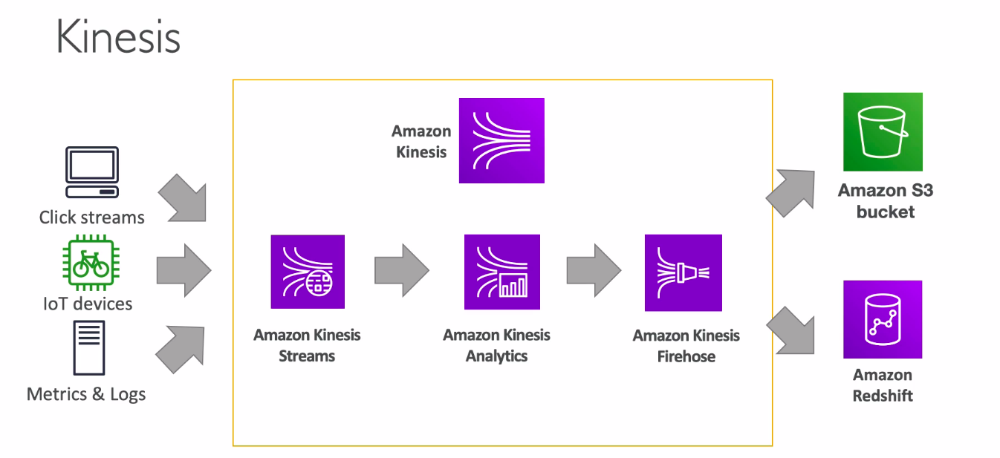
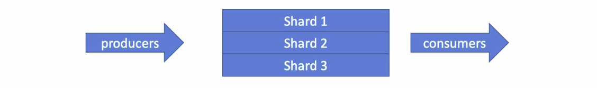

## Collection Introduction

* Real-Time - Immediate actions

Kinesis Data Streams (KDS)

Simple Queue Service (SQS)

Internet of Things (IoT)

* Near Real-Time - Reactive actions

Kinesis Data Firehose (KDF)

Database Migration Service (DMS)

* Batch - Historical Analysis

Snowball

Data Pipeline

## AWS Kinesis Overview

Kinesis is a managed alternative to Apacha Kafka
Great for application logs, metrics, IoT, clickstreams
Great for "real-time" big data
Great for streaming processing frameworks (Spark, Nifi, etc..)
Data is automatically replicated synchronously to 3AZ

- Kinesis Streams: low latency streaming ingest in scala
- Kinesis Analytics: perform real-time analytics on streams using SQL
- Kinesis Firehose: load streams into S3, Redshift, ElasticSearch & Splunk

## Kinesis Streams Overview

Streams are divided in ordered Shards/Partitions

Data rentention is 24 hours by default, can go up to 7 days

Ability to reprocess/replay data

Multiple applications can consume the same stream

Real-time processing with scala of throughput

Once data is inserted in Kinesis, it can't be deleted (immutability)

## Kinesis Streams Shards

One stream is made of many different shards

Billing is per shard provisionaed, can have as many shards as you want

Batching available or per message calls

The number of shards can evolve over time (reshard/merge)

Records are ordered per shard

## Kinesis Streams Records 

**Data Blob**: data being sent, serialized as bytes. Up to 1 MB. Can represent anything

**Record Key**: sent alongside a record, helps to group records in Shards. Same key = Same Shard.
> Use a highly distributed key to avoid the **"hot partition"** problem

**Sequence Number**: Unique identifier for each records put in shards. Added by Kinesis after ingestion

## Kinesis Streams Limits

**Producer**
- 1MB/s or 1000 messages/s at write PER SHARD
- "ProvisionedThroughputException" otherwise

**Consumer Classic**
- 2MB/s at read PER SHARD across all consumers
- 5 API calls per second PER SHARD across all consumers

**Consumer Enhanced Fan-Out**
- 2MB/s at read PER SHARD, PER ENHANCED CONSUMER
- No API calls needed (push model)

## Kinesis Producers 

* Kinesis SDK 
* Kinesis Producer Library (KPL)
* Kinesis Agent (runs in your servers, as any agent does)
* Third party libraries: Spark, log4j, appenders, flume, kafka connect, nifi...