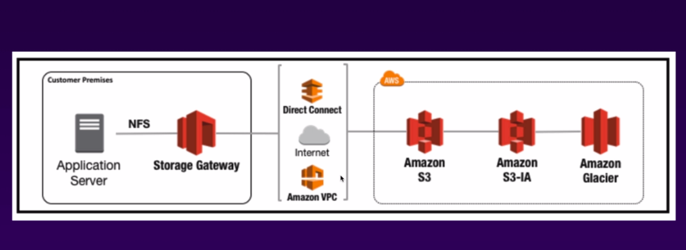
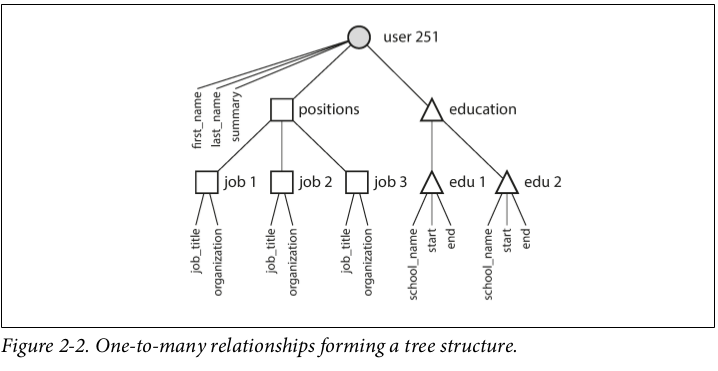

Index Topics

* AWS
* NIFI

## AWS
 > I’ve always been a software engineer. I used to have a general understanding of what Data Science and Analytics were. **What I didn’t know** was how **important it is** for the data **to respect a few requirements in order to be used effectively**, and how engineers can help make the data readily accessible.
 [*](https://medium.com/bolt-labs/want-to-be-a-data-engineer-heres-what-you-need-to-know-68f7575dc6d8)

* AWS Stuffs
  * Pricing Principles:
  
  * History:
    * > Inventions requires two things: 1. The ability to try a lot of experiments and 2. Not to having to live with the collateral damages of failed experiments. Andy Jassy
  * Services overview
  
  * Core concepts
    * The oldest region is the US East (Virginia) and this is where all the news services come out first
    * Availability zone vs Region vs Edge location
    * Global Infrastruture
    
    * Availability Zone is essentially a big data center each with redundant power, networking and connectivity and etc.
    * Availability Zone may have a lot of data center but cuz them are so close, they counted as 1 AZ.
    
    * Region is a geografical area, each region has 2 or more AZ
    
    * Region is a physical location spread across the globe to host your data to reduce **latency**.
    
    * Edge Location are used for caching content
    
    * Edge Location are located in most of the major cities around the world and are specifically used by CloudFront(Content Delivery Network - CDN) to distribute content to end user to reduce **latency**.
    
    * There are more Edge Location than Regions.
  * IAM (Identity and Access Management)
    
    * Enables you to manage access to AWS services and resources securely. Using IAM, you can create and manage AWS users and groups, and use permissions to allow and deny their access to AWS resources.
    
    * Everything you do here is in global region, itsn't belong to a one specific region.
    * Enables you to manage users and their level of access for aws stuffs.
    * Features[*](https://info.acloud.guru/team-cloud-technology-training?adchannel=Google&paidcampaign=1648420462&paidadgroup=64616557178&paidkeyword=kwd-411849373105&paidad=315261896152&gclid=EAIaIQobChMIpseVr-394QIVCCaGCh1zSQNmEAAYASAAEgIr8PD_BwE):
      * Shared Access to your AWS Account
      
      * Centralised Control of your AWS Account
      
      * **Granular** Permission 
      * **Identity Federation** (Active Diretory, Facebook, Linkedin etc)
      * **Multifactor Authentication**
      * Provide temporary access for users/devices and services where necesssary
      * Allows you to set up your own password **rotation policy**
      * Integrates with many different AWS services
      * Support **PCI DSS Compliance** 
    *  ARN (Amazon Resource Name)[TODO] 
    * Users, Groups, Policies and Roles
      * > AWS Identity and Access Management (IAM) is a web service that helps you securely control access to AWS resources for your users. You use IAM to control who can use your AWS resources (authentication) and what resources they can use and in what ways (authorization).[*](https://serverless-stack.com/chapters/what-is-iam.html)
      * >When you first create an AWS account, you are the **root user**. The email address and password you used to create the account is called your root account credentials. You can use them to sign in to the AWS Management Console. When you do, **you have complete, unrestricted access to all resources in your AWS account**, including access to your billing information and the ability to change your password.[*](https://serverless-stack.com/chapters/what-is-iam.html)
      * Users
        * Users as people, organizations or something like that, and IAM user consists of a name, a password to sign into a AWS console. (Remember, Itsn't a good pratice give your root creadencials for someone, that's why you will prefer to create IAM users). 
        * By default users can't access anything in your account then you will to create policies to the users. 
        
        * New users are assigned **Access Key ID** and **Secret Access Key** when first created.
          * **Access Key ID** and **Secret Access Key** you get to view these just once time. If you lose them, you have to regenerate them. So, save them in a secure location.
        * These are not the same as a password, you cannot use **Access Key ID** and **Secret Access Key** to login into the console, you just can use theses to access API's and Command Line.
      * Policies
        * Polices as essentially documents theses documents are in a format called JSON and they give permissions as to what a User, Group or Role is able to do.  
        * You can attach a policy to a User, a Role or a Group.
        * ***Here a policy that grants all operations to all S3 buckets:***
            ```
            {
                "Version": "2012-10-17",
                "Statement": {
                    "Effect": "Allow",
                    "Action": "s3:*",
                    "Resource": "*"
                }
            }
            ```
        * ***Here a policy that grants more granular access, only allowing retrieval of files prefixed by the string Alanes- in the bucket called Hello-World***:
            ```
                {
                    "Version": "2012-10-17",
                    "Statement": {
                        "Effect": "Allow",
                        "Action": ["s3:GetObject"],
                        "Resource": "arn:aws:s3:::Hello-World/*",
                        "Condition": {"StringEquals": {"s3:prefix": "Alanes-"}}
                    }
                }
            ``` 
        * An IAM policy is **a rule** or **set of rules** defining the operations **allowed/denied** to be performed on **an AWS resource.**
      * Roles
        * Roles are permitions for resources. 
        
        * > Sometimes your **AWS resources need to access other resources** in your account. For example, you have a **Lambda function that queries your DynamoDB** to retrieve some data, process it, and then send Bob an email with the results. In this case, **we want Lambda to only be able to make read queries** so it does not change the database by mistake. We also want to restrict Lambda to be able to email Bob so it does not spam other people. **While this could be done by creating an IAM user and putting the user’s credentials to the Lambda function or embed the credentials in the Lambda code, this is just not secure.** If somebody was to get hold of these credentials, they could make those calls on your behalf. This is where IAM role comes in to play.[*](https://serverless-stack.com/chapters/what-is-iam.html)
        * A role does not have any credentials (password or access keys) associated with it
        * You need to associate policies for your roles.
        * Roles can be applied for Users.
        * > You can also have **a role tied to the ARN of a user from a different organization**. This allows the external user to assume that role as a part of your organization. **This is typically used when you have a third party service that is acting on your AWS Organization**. You’ll be asked to create a Cross-Account IAM Role and **add the external user as a Trust Relationship**. **The Trust Relationship is telling AWS that the specified external user can assume this role**.
        
      * Groups
        * A bunch of users. Each user in the group automatically has the permissions that are assigned to the group 
        * >  **If a new user joins your organization** and should have administrator privileges, you can assign the appropriate permissions by adding the user to that group. Similarly, if a person changes jobs in your organization, instead of editing that user’s permissions, you can remove him or her from the old groups and add him or her to the appropriate new groups.
        
      * MFA
        * > AWS Multi-Factor Authentication (MFA) **is a simple best practice that adds an extra layer of protection on top of your user name and password**. With MFA enabled, when a user signs in to an AWS website, **they will be prompted for their user name and password (the first factor— what they know)**, as well as for **an authentication response from their AWS MFA device (the second factor— what they have).** Taken together, these multiple factors provide increased security for your AWS account settings and resources. 
        You can enable MFA for your AWS account and for individual IAM users you have created under your account. MFA can be also be used to control access to AWS service APIs.
  * Billing Alarm
    * > You can monitor your **estimated AWS charges** using Amazon CloudWatch.
    **Billing metric data is stored in the US East (N. Virginia)** region and represents worldwide charges. This data includes the estimated charges for every service in AWS that you use, in addition to the estimated overall total of your AWS charges. **The alarm triggers when your account billing exceeds the threshold you specify**. **It triggers only when actual billing exceeds the threshold.** It does **not use projections based on your usage so far in the month.**[*](https://docs.aws.amazon.com/AmazonCloudWatch/latest/monitoring/monitor_estimated_charges_with_cloudwatch.html)
  * S3 [*](https://www.amazonaws.cn/en/s3/faqs/)
    * **Offers a highly-scalable, reliable, and low-latency data storage** infrastructure at very low costs.
 
    * **A simple webservice interface** you can use to **store and retrieve any amount of data**, at any time, from anywhere on the web. 
 
    * The total **volume of data** and number of objects **you can store are unlimited**.
 
    * Individual Amazon **S3 objects can range in size from 0 bytes to 5 terabytes**. 
    * Not suitible by to install an OS
    * Successful uploads will generate 
 a HTTP 200 status code.
    * **The largest object that can be uploaded in a single PUT is 5 gigabytes.**

    * Multipart Upload (for objects larger than 100 megabytes is essential, but you should consider to use it even in object > 5MB)[*](http://docs.amazonaws.cn/en_us/AmazonS3/latest/dev/mpuoverview.html):
      * Upload objects in parts that **can be uploaded independently**, **in any order**, **and in parallel**.
      * When you should consider to user Multipart Upload
        * > If you're uploading large objects over a stable high-bandwidth network, use multipart uploading to maximize the use of your available bandwidth by uploading object parts in parallel for multi-threaded performance.
        * > If you're uploading over a spotty network, use multipart uploading to increase resiliency to network errors by avoiding upload restarts. When using multipart uploading, you need to retry uploading only parts that are interrupted during the upload. You don't need to restart uploading your object from the beginning.
      * Advantages:
        * > Improved throughput - You can upload parts in parallel to improve throughput.
        * > Quick recovery from any network issues - Smaller part size minimizes the impact of restarting a failed upload due to a network error.
        * > Pause and resume object uploads - You can upload object parts over time. Once you initiate a multipart upload there is no expiry; you must explicitly complete or abort the multipart upload.
        * > Begin an upload before you know the final object size - You can upload an object as you are creating it.
      *  **Multi-Object Delete to delete large numbers of objects from Amazon S3.** This feature allows you to send **multiple object keys in a single request to speed up your deletes**.
     *  Key-based object store. When you store data, you assign a unique object key that can later be used to retrieve the data.
     *  **S3 Standard is designed for 99.99% availability** and **Amazon guarantee is 99.9% availability**
     *  **S3 Standard IA is designed for 99.99% availability**
     *  Amazon guarantee 99.999999999% of durability
     *  Stored redundantly accross devices in multiples facilities (instalações)
     *  Files are storage in buckets (it means, folders are you put your files)
        *  S3 use a global namespace so bucket must be uniques.
    * Monitor, analyze and optimize
        
    * S3 has:
      * objects or files 
        * has tags and prefix
          

      * keys(are objects names)
      * values, it means, a simple sequence of bytes.
      * version id (it allow a s3 to have multiples versions of a file)
      * metadata, it means, data about data.
      * subresources
        *  Access Control List
        *  Torrent
    * Data consistency in s3:
      * Read after write consistency for PUTS of new objects. (if you write the file and read it immediately afterwards you will be able to view the data)
      * Eventual Consistency for overwrites PUTS and Deletes (if you update an existing file or delete a file and read it immediately, you may get the older version, or you may not. It means, can take some time to propagate)
    * S3 Storage Class:
      * It's import choice the right storage class
      
      * IA
        *  IA means infrequently accessed
        *  Used mainly when data is less accessed but requires rapid access. Lower fee than S3 Stardand but you will be charged for retrieval. 
      * Standard
      * One Zone
      * Intelligent Tiering
        * 
      * Glacier
      * Glacier Deep Archive
      
      
      
      
    * S3 features:
      * Tiered Storage Available
      * Lifecycle Management
      * Security and Encryption
      * Version Control
      * Cross Region Replication
      * Transfer Acceleration
      * MFA Delete
      * Secure your data using Access Control List or Bucket Policies
    * Pricing
      * Storage
      * Requests
      * Storage Management
      * Cross Region Replication
      * Data Transfer
      * Transfer Acceleration
    * Security and Encryption
      * By default, all created bucket all PRIVATES
      * S3 Buckets can be configured to create access logs which logs all requests made to the s3 Bucket or even other Bucket in another account.
      * Encrypt In Transit:
        * SSL/TLS
      * Encrypt At Rest:
        * S3 Managed Keys - SSE-S3
        * Server Side Encryption With Customer - Provided Keys - SSE-C 
        * AWS Key Management Services, Managed Keys-SSE-KMS
      * Client Side
    * Versioning
      * Store all version of an object (including all writes and even if you delete an object)
      * Great backup tool
      * One time enabled cannot be disable, only suspended.
      * Integrates with lifecycle rules.
      * Versining's MFA DELETE capabilities. 
    * Lifecycle management
      * Automates moving your objects between the differents storage tiers.
      * Can be used in conjuction with versioning.
      * Can be applied to current and previous versions.
    * Cross Regions Replication
      * Version must be enabled on both the source and destination bucket.
      * Regions must be unique
      * Files in an existing bucket are not replicated automatically.
      * All subsequent files will be replicated automatically.
      * Delete markers are not replicated.
      * Delete individual versions or delete markers will not be replicated.
    * S3 Transfer Acceleration 
      * HIPAA compliant
      * utilises the CLoud Front Edge Network to accelerate your uploads to S3. Instead of uploading directly to your bucket S3, you can use a distinct URL to upload directly to an edge location which will then transfer that file to S3.  
      
      * Trasfer Acceleration Tool[*](https://aws.amazon.com/premiumsupport/knowledge-center/upload-speed-s3-transfer-acceleration/)

    * Workloads Patterns
      * Frequently accessed data
      
      * Infrequently accessed data
      
      * Infrequently accessed data
      
      * Unknown Access Patterns
      
  * Cloud Front 
    * A content delivery network (CDN) is a system of distributed systems servers (networks) that delivery webpages and other web content to a user based on the geographic locations of the user, the origin of the webpage,and a content delivery server.
    * Key terminologies:
      * Edge Location: 
        * This is the location where the content will be cached. This is separate to an AWS Region/AZ  
      * Origin:
          * This is the origin of all files that the CDN will distribute. This can be an S3 Bucket, an EC2 Instance, an Elastic Load Balancer, or Route53
      * Distribuition 
        * This is the name given the CDN, which consists of a collection of Edge Locations. 
    * What it's mean?
      * CF can be used to delivery your entire website, including AMI(Amazon Machine Images), static, streaming, and interactive content using a global network of edge locations. Requests for your content are automatically routed to the nearest Edge Location, so content is delivered with the best possible performace.
    * Types of Distribuition
      * RTMP:    
        * Used for media streaming
      * Web Distribuition:
        * Typically used for Websites
    * Tips
      * Edge Location are not just READ ONLY - you can write to them.
      * Objects are cached for the Time To Live (TTL)
      * You can invalidate cached objects, but you will be charged.
     
  * Snowball
    * is a petabyte-scale data transport solution that uses secure appliances to transfer large amounts of data into and out of Amazon. Using Snowball addresses common challenges with large-scale data transfer including high networks costs, long transfer times, and security concerns. Tranfering data with Snowball is simple, fast, secure, and can be as little as one-fifth the cost of high speed internet.
     
    * Comes in either a 50TB or 80TB
    * Uses a multiple layers of security designed to protect your data including tamper-resistant enclusures.
    * import and export to s3.
    * 256-bit encryption.
    * and a industry-standard Trusted Platform Module (TPM) to ensure both security anf full chain of custody of your data. 
    * AWS Snowball Edge is a 100TM data transfer device with on-board storage and compute capabilities. You can use Snowball Edge to move large amounts of data into and out AWS, as a temporary storage tier for large local datasets or support local workloads in remoto or offline locations.
    * Snowmobile
      
      * Exabyte-scale data transfer used to move extremely large amounts of data to AWS.
      * up to 100PB by snowmobile.
      * Makes easy to move massive volumes of data to the cloud (videos, libraries, images, or even a complete datacerter migration)
      * secure, fast and cost effective
    * When should I consider using Snowball instead of the Internet?
    
  
  * Storage Gateway
    * Essentialy a manner of replication your local data to AWS.
    * Is a service that connects an on-promises softwares to provide seamless and secure integration between an organization's on promises IT enviroment and AWS's Storage Infrastructure. 
    * This will replicate your data to AWS.
    * It's available for download as a Virtual Machine (VM) image then you can install on a host in your data center.
    * It's support either ESXi or Microsoft Hyper-V.
    * There are three differentes types of SG:
      * File Gateway (NFS)
        * for flat files, stored directly on S3 
      * Volume Gateway (iSCI)
        * Store Volumes
          * Entire Dataset is stored on site and is assynchronously backed up to S3.
        * Cached Volumes
          * Entire Dataset is stored on S3 and the most frequently accessed data is cached on site.
      * Tape Gateway (VTL - Virtual Tape Library)
    * File Gateway (NFS - Network File System)
      * Files are storage in your S3 Buckets, accessed through a Network File System (NFS) mount point. Ownership, permissions, and timestamps are durably stored in S3 in the user-metadata of the object associated with the file. 
      * Once objects are transferred to S3 they can managed as native S3 objects.
      
    * Volume Gateway (Small Computer System Interface (iSCSI) )
      * The volume interface presents you application with disks volumes using the iSCI block protocol
      * Data written to these volumes can be assynchronously backed up as point-in-time snapshots of your volumes, and stored in the cloud as Amazon EBS snapshots.
      * Snapshots are incremental backups that capture only changed blocks. All snapshots storage is all compressed to minimize your storage charges. 
      * Stored Volumes:
        * > If you need low-latency access to your entire dataset, first configure your on-premises gateway to store all your data locally. Then asynchronously back up point-in-time snapshots of this data to Amazon S3. This configuration provides durable and inexpensive offsite backups that you can recover to your local data center or Amazon EC2. For example, if you need replacement capacity for disaster recovery, you can recover the backups to Amazon EC2. [*](https://docs.aws.amazon.com/storagegateway/latest/userguide/WhatIsStorageGateway.html)
        * 1GB - 16TB in size for Stored Volumes.
      * Cached volumes: 
        * > You store your data in Amazon Simple Storage Service (Amazon S3) and retain a copy of frequently accessed data subsets locally. Cached volumes offer a substantial cost savings on primary storage and minimize the need to scale your storage on-premises. You also retain low-latency access to your frequently accessed data.
        * 1GB - 32TB in size for Cached Volumes.
        * 
    * Tape Gateway 
        * > With a tape gateway, you can cost-effectively and durably archive backup data in Amazon S3 Glacier or S3 Glacier Deep Archive. A tape gateway provides a virtual tape infrastructure that scales seamlessly with your business needs and eliminates the operational burden of provisioning, scaling, and maintaining a physical tape infrastructure.
        
  * EC2 (Elastic Compute Cloud)
    * It's a Virtual Machine (VM) in the cloud.
    * Is a web service that provides resizable compute capacity in the cloud. 
    * Reduce the time required to obtain and boot new server instances to minutes, allowing you to quickly scale capacity, both up and down, as your computing requirements change. 
    * The AWS Pricing 
    
    * EC2 Pricing Models 
      * On demand
        * Allows you to pay a fixed rate by the hour (or by the second) with no commitment
      * Reserved
        * Provides you with a capacity reservation, and offer a significant discount on the hourly charge for an instance. Contract Terms are 1 Year or 3 Year Terms  
      * Spot
        * Enables you to bid whatever price you want for instance capacity, providing for even greater savings if your applications have flexible start and end times.
      * Dedicated Hosts
        * Physical EC2 server dedicated for your use. Dedicated Hosts can help you reduce costs by allowing you to use your existing server-bound software licenses.
    * When to use one or other?
      * On demand
        * Users that want the low cost and flexibily of Amazon EC2 without any up front payment or long-term commitment.
        * Applications with short term, spike, or unpredictable workloads that cannot be interrupted. 
        * Applications being developed or tested on Amazon EC2 for the first time.
      * Reserved 
        * Applications with steady state or predictable usage.
        * Applications that require reserved capacity.
        * Users able to make upfront payments to reduce their total computing costs even futher.
        * Types:
          * Standard Reserved Instances
            * These offer up to 75% off on demand instances. The more you pay up front and the longer the contracts, the greater the discount. 
          * Convertible Reserved Instances
            * These offer up to 54% off on demand capability to change the attributes of the RI as long as the exchange results in the creation of RI of equal or greater value.
          * Scheduled Reserved Instances
            * These are available to launch within the time windows you reserve. This option allows you to match your capacity reservation to a predictable recurring schedule that only requires a fraction of a day, a week, o a month.
      * Spot
        * Applications that have flexible start and end times.
        * Applications that are only feasible at very low compute prices.
        * Users with urgent computing needs for large amounts of additional capacity.
        * If the Spot instance is terminated by Amazon EC2, you will not be charged for a partial hour of usage. However, if you terminate the instance yourself, you will be charged for any hour in which the instance ran.
      * Dedicated Hosts 
        * Useful for regulatory requirements that may not support multi-tenant virtualization.
        * Great for licensing which does not support multi-tenancy or cloud deployments.
        * Can be purchased On-Demand (hourly)
        * Can be purchased as a Reservation up to 70% off the On-Demand price.
    * EC2 Instances Types:
      * Tip: the number doesn't matter, It's just about generation.
      
    * EC2 Instances Types 
      * Fight DoRctor MaC PiXels ZAU
      
    * Tips
      * Termination Protection is **turned off** by default, you must turn it on.
      * On an EBS-Backed instance, the **default action is for the root EBS volume to be deleted** when the instance is terminated. 
      * Additional EBS volume will persist later the EC2 instance were terminated. 
      * EBS Root Volumes of your DEFAULT AMI(Amazon Machine Images)'s cannot be encrypted. You can also use a third party tool (such as bit locker etc) to encrypt the root volume, or this can be done when creating AMI(Amazon Machine Images)'s in the AWS console or using API.
      * The root volume is where the OS are.
      * Additional volumes can be encrypted.
      * If an Amazon EBS volume is an additional partition (not the root volume), I can detach it without stopping the instance, although it may take some time.
  * Security Group
      * If you apply any change in security group this change take effect immediately.
      * All inbound traffic is blocked by default.
      * All Outbound traffic is allowed.
      * You can have any nymber of EC2 instances within a security group. 
      * You can have multiple security groups attached to EC2 Instances.
      * Security group are STATEFUL
        * If you create an inbound rule allowing traffic in, that traffic is automatically allowed back out again. 
      * You cannot block specific IP addresses using Security Groups, instead use Network Access Control Lists.
      * You can specify allow rules, but not deny rules.
  * What's EBS?
      * Amazon Elastic Block Store (EBS).
      * Provides persistent block storage volumes for use with Amazon EC2 Instances.  
       
      * Each EBS volume is automatically replicated within its Availability Zone to protect you from component failure, offering high availability and durability.
    * 5 Differents Types of EBS Storage
      * General Purpose (SSD)
      * Provisioned IOPS (I/O per second) (SDD)
      * Throughput Optimised Hard Drive Disk
      * Cold Hard Disk Drive
      * Magnetic
       
    * Tips
      * **If you wanna create/move a instance in another region, you must to create a snapshot of it then create a AMI(Amazon Machine Images) from this snapshot. After copy the AMI(Amazon Machine Images) from one region to other. Then you can use the copied AMI(Amazon Machine Images) to launch the new EC2 instance in the new region.**
      * **If you wanna create/move a EC2 volume from one AZ to other, take a snapshot of it,create a AMI(Amazon Machine Images) from the snapshot and then use the AMI(Amazon Machine Images) to launch the EC2 instance in new AZ.**
      * Volumes exist on EBS. Think of EBS as a virtual virtual hard disk.
      * Snapshot exist on S3. Think of snapshot as a photograph of the disk.
      * Snapshots are point in time copies of Volumes.
      * Snapshots are incremental - only the blocks that have changed since your last snapshot are moved to S3.
      * The first snapshot will take some time to be created.
      * You can create a snapshot from a running instance, but it's indicate that you create a snapshot after you stop a instance in order to avoid integrity issues.
      * You can create AMI(Amazon Machine Images)'s from snapshots and volumes.
      * You can change EBS volumes sizes on the fly, including changing the size and storage types.
      * Volumes alwais will be in the same AZ as the EC2 ISNTANCE.
    * How you can select your AMI'S?
      * Region
      * OS
      * Architecture (32-bit or 64-bit)
      * Launch Permissions
      * Storage for the Root Device (Root Device Volume)
        * You have some options:
          * Instace Store (**EPHEMERAL STORAGE**) 
          * EBS Backed Volumes 
    * Encrypted Volumes
      * Snapshots of encryted volumes are encrypted automatically
      * Volumes restored from encrypted snapshots are encrypted automatically.
      * You can share snapshots, but only them are unecrypted.
      * These snapshots can be shared with other AWS accounts or made public.
    * How to create a encrypted snapshot?
      * Create a snapshot of the unecrypted root device volume
      * Then do a copy of the snapshot and select the encrypt option
      * Create a AMI from the encrypted Snapshot
      * Use that AMI to launch new encrypted instances.
  *  Cloud Watch
     *  is a monitoring service to monitor your AWS resources, as well as the application that you run on AWS.
     *  In essential CW monitor performace.
     *  Host Level Metrics are:
        *  CPU
        *  Network
        *  Disk
        *  Status Check (yes or no running?)
  *  Cloud Trail
     *  increases visibility into your use and resource activity by recording AWS Management Console actions and API calls. You can identify which users and account called AWS, the source IP address from which the call were made, and when the calls occurred. 
    
  * Cloud Watch vs Cloud Trails
    * CW monitor performance, CT monitor API calls in the AWS platform.
  * Tips
    * Cloud Watch can monitor most of AWS as well as your application that run on AWS.
    * Cloud Watch with EC2 will monitor events every 5 minutes by default.
    * You can have 1 minute intervals by turning on detailed monitoring
    * You can create CloudWatch alarms which trigger notifications.
    * CloudWatch is all about performance. CloudTrail is all about auditing. 
  * What can I do with CloudWatch?
    * Create awesome dashboards to see what is happened with your enviroment.
    * Allows you to set Alarms that notify you when particular thresholds are hit.
    * CloudWatch Events helps you to respond to state changes in your AWS resources.
    * CloudWatch Logs helps you to aggregate, monitor and store logs.
  * AWS Cli
    * >The AWS Command Line Interface (CLI) is a unified tool to manage your AWS services. With just one tool to download and configure, you can control multiple AWS services from the command line and automate them through scripts. - aws
    * You will need to set up access in IAM.
    * Remember that roles are more secure then storing your access key and secret access key on individual EC2 instances, beyond that roles are easier to manage.
    * Roles can be assigned to an EC2 instance after it is created using both the console and command line.
    * Roles are universal - you can use them in any region.
  * Instance MetaData
    * Used to get information about an instance (such as public ip)
    * curl *http://169.254.169.254/latest/meta-data/*
    * curl *http://169.254.169.254/latest/user-data/*
  * EFS
    * > Amazon Elastic File System (Amazon EFS) provides a simple, scalable, elastic file system for Linux-based workloads for use with AWS Cloud services and on-premises resources. It is built to scale on demand to petabytes without disrupting applications, growing and shrinking automatically as you add and remove files, so your applications have the storage they need – when they need it. It is designed to provide massively parallel shared access to thousands of Amazon EC2 instances, enabling your applications to achieve high levels of aggregate throughput and IOPS with consistent low latencies. Amazon EFS is a fully managed service that requires no changes to your existing applications and tools, providing access through a standard file system interface for seamless integration. There is a Standard and an Infrequent Access storage class available with Amazon EFS. Using Lifecycle Management, files not accessed for 30 days will automatically be moved to a cost-optimized Infrequent Access storage class, giving you a simple way to store and access active and infrequently accessed file system data in the same file system while reducing storage costs by up to 85%. Amazon EFS is a regional service storing data within and across multiple Availability Zones (AZs) for high availability and durability. You can access your file systems across AZs, regions, and VPCs and share files between thousands of Amazon EC2 instances and on-premises servers via AWS Direct Connect or AWS VPN. - AWS
    * Supports for Network File System version 4 (NFSv4) protocol
    * You only pay for the storage use (no pre-provisioning required)
    * Can scale up to petabytes
    * Can support thousands of concorrent NFS connectios.
    * Data is storage across  multiple AZ's within a region.
    * Read after Write consistency
  * EC2 Placement Groups
    * The name you specify for a placement group must be unique within your AWS account.
    * Only certain instances can be launched in to a placement group (Compute Optimized, GPU, Memory Optimized, Storage Optimized)
    * AWS recommend homogenous instances within placement groups.
    * You cannot merge placement groups.
    * You cannot move an existing instance into a placement group. You can create an AMI from your existing instance and then launch a new instance from the AMI into a placement group.
    * There are two types of placement groups:
      * Clustered Placement group
        * A cluster placement group is a grouping of instance within a single Availability Zone. Placement groups are recommended for applications that need low lantecy, high network throughput, or both.
        * Only certain instances can be launched in to a Clustered Placement Group.
        * Cannot span multiple Availability Zones.
      * Spread Placement group
        * is a group of instances that are each placed on distinct underlying hardware
        * are recommended for applications that have a small number of critical instances that should be kept separate from each other.
        * Can span multiple Availability Zones.
  * Database
    * Relational Database on AWS:
      * SQLServer, Oracle, PostgreSQL, MySQLServer, Aurora, MariaDB.
    * RDS
      * Relational database manager by aws
      * **runs on a virtual machine**
      * **You cannot log in to these OS however.**
      * Patching of the RDS Operating Systems and DB is Amazon's responsability.
      * RDS is NOT Serverless.
      * Aurora Serverless IS Serverless.
      *  has two keys features:
      * Multi AZ - For Disaster Recovery
      
      * Read Replicas - For Performance
      
      * Strategy for Disaster Recovery
        * You do it using DNS.
        * 
        * 
      * Strategy for Read Replicas
        * 
      * NoSQL Database: 
        * > simplicity of design, simpler "horizontal" scaling to clusters of machines (which is a problem for relational databases),[2], finer control over availability and limiting the Object-relational impedance mismatch[9]. The data structures used by NoSQL databases (e.g. key-value, wide column, graph, or document) are different from those used by default in relational databases, making some operations faster in NoSQL. The particular suitability of a given NoSQL database depends on the problem it must solve. Sometimes the data structures used by NoSQL databases are also viewed as "more flexible" than relational database tables.
        * > Instead, most NoSQL databases offer a concept of "eventual consistency" in which database changes are propagated to all nodes "eventually" (typically within milliseconds) so queries for data might not return updated data immediately or might result in reading data that is not accurate, a problem known as stale reads
      * DataWarehousing
        * Used for business intelligence.
        * Used to pull in very large and comples data sets. Usually used by management to do queries on data.
      * OLTP vs OLAP
        * OLTP - Online Transaction Processing differs from OLAP - Online Analytics Processing in terms of the type of queries you will run.
          * OLTP example: order number 123 pulls up a row of data such as name, address to delivery...
          * OLAP example: Pulls in a large numbers of record and sum all the orders realized by a country, or a city...
      * ElastiCache
        * is a web service that makes it easy to deploy, operate, and scale an in-memory cache in the cloud. The service provide improves the performance of web applications by allowing you to retrieve information from fast, managed, in-memory caches instead of relying entirely on slower disk-based databases.
        * supports two open-source in memory 
        * Speed up performance of existing databases (frequent identical queries)
        * cache engines:
          * Memcached
          * Redis
        * Tips
          * OLTP
            * SQLServer, Oracle, PostgreSQL, MySQLServer, Aurora, MariaDB. 
          * OLAP 
            * Redshift - For business intelligence or data warehouse.
          * NoSQL
            * DynamoDB
  * Backups for RDS
    * There are two different types of Backups for RDS
      * Automated Backups
        * Allows you to recovery your database to any point in time within a "retetion period". The retetion period can be between one and 35 days. Automated Backups will take a full daily snapshots and will also store transactions logs throughout the day. When you do a recovery, AWS will first choose the most recent daily backup, and then apply transaction logs relevant to that day.  
        * This allows you to do a point in time recovery down to a second, within the retention period.
        * Automated Backups are enabled by default.
        * The backup data is stored in S3 and you get free storage space equal to the size of you database. So if you have an RDS instance of 10Gb, you will get 10 Gb worth of storage.
        * Backups are taken within a defined window. During the backup window, storage I/O may be suspended while your data is being backed up and you may experience elevated latency.
        
      * Database Snapshots
        * **DB Snapshots** are **done manually** (ie they are user initiated) They are **stored even after you delete the original** RDS instance, **unlike automated backups**.
      
      * Encryption
        * **Encryption At Rest**
          * is supported for **MySQL, Oracle, SQL Server, PostgreSQL, MariaDB & Aurora.** Encryption is **done using the AWS Key Management Service (KMS)**. Once your **RDS instance is encrypted, the data stored at rest in the underlying storage is encrypted, as are its automated backups,read replicas, and snapshots**.
      * What is Multi AZ?
        * 
        * Multi-AZ **allows you to have an exact copy of your production database in another Availability Zone**. **AWS handles the replication for you**, so when your production database is written to, this write will automatically be synchonized to the stand by database.
        * In the event of planned database maintenace, DB Instance failure, or an Availability Zone failure, Amazon RDS will automatically failover to the standby so that database operations can resume quickly without administrative intervention.
        * Multi-AZ **is for disaster recovery only.**
          * It's not primarily used for improving performance, if you wanna performance improvement, you need Read Replicas.
        * Multi AZ is available for: 
          * SQL Server, 
          * Oracle
          * MySQL Server
          * PostgreSQL
          * MariaDB
      * What is a Read Replica?
        * 
        * Read Replicas allow you to have a read-only copy of your production database. This is achieved by using Asynchronous replication from the primary RDS instance to the replica. You use read replicas primarily for very read-heavy database workloads.
        * Read Replicas are available for:
          * MySQL Server
          * PostgreSQL
          * MariaDB
          * Aurora
        * Used for scaling not for disaster recovery
        * must have automatic backups turned on in order to deploy a read replica.
        * you can have up to 5 read replica copies of any database.
        * you can have read replicas of read replicas (but watch out for latency)
        * Each Read Replica will have its own DNS endpoint.
        * You can have read replicas that have Multi AZ.
        * You can create read replicas of Multi AZ source databases.
        * Read replicas can be promoted to be their own databases, it means, to be master. This breaks the replication.
        * You can a read replica in differents regions. 
  * DynamoDB
    * > Amazon DynamoDB is a key-value and document database that delivers single-digit millisecond performance at any scale. It's a fully managed, multiregion, multimaster database with built-in security, backup and restore, and in-memory caching for internet-scale applications. DynamoDB can handle more than 10 trillion requests per day and can support peaks of more than 20 million requests per second.
    * > Many of the world's fastest growing businesses such as Lyft, Airbnb, and Redfin as well as enterprises such as Samsung, Toyota, and Capital One depend on the scale and performance of DynamoDB to support their mission-critical workloads.
    * Stored on SSD storage, that's why is so fast.
    * Spread across 3 geographically distinct data centres.
    * **Eventual Consistent Reads (Default)**
    * **Strongly Consistent Reads**
    * Whats mean Eventual Consistent Read?
      * Consistency across all copies of data is usually reached within a second. Repeating a read after a short time should return the updated data (Best Read Performance)
    * Whats mean Strongly Consistent Read?
      * A strongly consistent read return a result that reflects all writes that received a successful response prior to the read.
  * Redshift
    * for business intelligence
    * > Amazon Redshift **is a fast**, **scalable data warehouse** that makes it simple and cost-effective to analyze all your data across your data warehouse and data lake. Redshift delivers **ten times faster performance than other data warehouses by using machine learning**, **massively parallel query execution**, **and columnar storage on high-performance disk**. You can setup and deploy a new data warehouse in minutes, and run queries across petabytes of data in your Redshift data warehouse, and exabytes of data in your data lake built on Amazon S3. You **can start small for just $0.25 per hour and scale to $250 per terabyte per year**, less than one-tenth the cost of other solutions.
    * Redshift can be configured as follows
      * Single Node (160Gb)
      * Multi Node
        * Leader Node (manages client connections and receives queries) 
        * Compute Node (store data and performs queries and computations). Up to 128 Compute Nodes.
        
      * Massively Parallel Processing (MPP)
        * Automatically distributes data and query load across all nodes. Amazon Redshift makes it easy to add nodes to your data warehouse and enables you to maintain fast query performance as you data warehouse grows.
      * Backups
        * Enabled default with a 1 day retention period.
        * Maximum retention period is 35 days.
        * Redshift always attempts to maintain at least three copies of your data (the original and replica on the compute nodes and backup in Amazon S3)
        * Redshift can also **asynchronously replicate your snapshots to S3** in another region **for disaster recovery.**
      * Redshift is priced follow
        * Compute Node Hours (total number of hours you run across all your compute nodes for the billing period. You are billed for 1 unit per node per hour so a 3-node data warehouse cluster running persistently for an entire month would incur 2.160 instance hours. You will not be charged for leader node hours; only compute nodes will incur charges.) 
        * Backup
        * Data Transfer (only within a VPC, not outside it)
      * Security
        * Encrypt in transit using **SSL**.
        * Encrypt at Rest using **AES-256** encription
        * By default Redshift takes cara of key management.
          * Manage your own keys through **HSM**
          * **AWS Key Management Service**
      * Availability 
        * Current only available in 1AZ.
        * Can restore snapshots to new AZs in the events of an outage.
  * Aurora
    * > Amazon Aurora is a MySQL and PostgreSQL-compatible relational database built for the cloud, that combines the performance and availability of traditional enterprise databases with the simplicity and cost-effectiveness of open source databases.

    * > Amazon Aurora is up to five times faster than standard MySQL databases and three times faster than standard PostgreSQL databases. It provides the security, availability, and reliability of commercial databases at 1/10th the cost. Amazon Aurora is fully managed by Amazon Relational Database Service (RDS), which automates time-consuming administration tasks like hardware provisioning, database setup, patching, and backups.

    * > Amazon Aurora features a distributed, fault-tolerant, self-healing storage system that auto-scales up to 64TB per database instance. It delivers high performance and availability with up to 15 low-latency read replicas, point-in-time recovery, continuous backup to Amazon S3, and replication across three Availability Zones (AZs).
    * Cools things about Aurora
      * Start with 10GB, Scales in 10GB increments to 64TB (Storage Autoscaling)
      * Compute resources can scale up to 32vCPUs and 244GB of Memory.
      * 2 copies of your data is contained in each availability zone, with minimum of 3 AZ. It means, 6 copies of your data.
      * transparently handle the loss of up to two copies of data without affecting database write availability and up three copies without affecting read availability.
      * Aurora storage **is also self-healing**. Data blocks and disks are continuously scanned for errors and repaired automatically.
      * 
    * Backups
      * Automated Backups are always enabled on Amazon Aurora DB Instances. Backups do not impact database performance.
      * You can also take snapshots with Aurora. This also does not impact on performance.
      * You can share Aurora Snapshots with other AWS accounts. 
      * 2 types of replicas available. Aurora Replicas and MySQL replicas. Automated failover is only available with Aurora Replicas.
  * Elastic Cache
    * > Amazon ElastiCache offers fully managed Redis and Memcached. Seamlessly deploy, run, and scale popular open source compatible in-memory data stores. Build data-intensive apps or improve the performance of your existing apps by retrieving data from high throughput and low latency in-memory data stores. 
    * > Improves the performance of web applications by allowing you to retrieve information fast, managed, in-memory caches, instead of relying entirely on slower disk-based databases.
    * Support two engines:
      * memcached
      * redis
      * 
  * DNS
    * What's DNS?
      * DNS is used to convert human friendly domain names (http://www.google.com) into an Intert Protocol (IP) address (http://123.43.23.22)
      * IP address are used by computers to identify each other on the network. IP addresses commonly come in 2 different forms IPv4 and IPv6. 
      * 
    * IPv4 vs IPv6
      * IPv4 space is 32bit field and has over 4 billion different addresses.
      * IPv6 was created to solve this depletion issue and has an address space of 128bits which in teory is 340 undecilion addresses.
    * Top level Domains
      * The last word in a domain name represents the "top level domain". The second word in a domain name is known as a second level domain name (this is optional though and depends on the domain name.)
      * .com
      * .com.br
      * .edu
      * These top levels domain name are controlled by the Internet Assigned Numbers Authority ([IANA](https://www.iana.org/domains/root/db)) in a root zone database which is essentially a database of all available top level domains. 
      * Because all of the names in a given domain have to be unique there needs to be a way to organize this all so that domain names are't duplicated. This is where domain registrars come in. A register is an authority that can assign domain names directly under one or more top level domains.
      * These domains are registered with InterNIC, a service of ICANN, which enforces uniqueness of domain across the internet. Each domain name becomes registred in a central database known as the **Who'Is database**.
      * When you bought a domain every DNS begins with a SOA (Start of Authority Record)
        * Store information about:
          * The name of the server that supplied the data for the zone.
          * The administrator of the zone.
          * The current version of the data file.
          * The default number of seconds for the time-to-live file on resources records.
      * NS stands for Name Server Records
        * They are used by Top Level Domain servers to direct traffic to the Content DNS server which contains the authoritative DNS Records.
        * 
      * What's an 'A Record'?
        * The 'A' in 'A Record' stands for Address. The A Record is used by a computer to translate the name of the domain to IP Address.
      * What's a CNAME?
        * A canonical name can be used to resolve one domain name to another. For example, www.m.google.com and www.mobile.google.com and both point to the same domain IP address.
      * Alias Record
        * They are used to map resource record set in your hosted zone to Elastic Load Balancers, Cloud Front distributions,or S3 buckets that are configured as websites.
        * Alias records work like a CNAME record in that you can map one DNS name (www.site.com) to another target DNS name (elb123.elb.amazonaws.com)
      * CNAME vs Alias
        * A CNAME can't be used for **naked domain**(basically it's a entire domain withou www) names (zone apex record). You can't have a CNAME for http://google.com, it must be either an A Record or an Alias.
  * Route53 (route 66 and DNS Port 53)
    * ELB's do not have pre-defined IPv4 addresses; you resolve to them using a DNS name.
    * Common DNS Types:
      * SOA Records
      * NS Records
      * A Records
      * CNAMES
      * MX Records
      * PTR Records
    * It's possible to buy domain names directly with AWS.
      * It can takes up to 3 days to register depending on the circumstances.
    * Routing Policies availables for Route53
      * Simple Routing
      * Weighted Routing
      * Latency-based Routing
      * Failover Routing
      * Geolocation Routing
      * Geoproximity Routing (Traffic Flow Only)
      * Multivalue Answer Routing
    * Simple Routing
      * You can only have one record with multiple IP Addresses. If you specify multiples values in a record, Route 53 return all values to the user in a random order. 
      * 
    *  Weighted Routing
       *  Allows you split your traffic based on different weights assigned.
       *  For example, you can set 10% of your traffic to go to US-EAST-1 and 90% EU-WEST-1
       *  
    *  Health Checks
       *  You can set health checks on individual record sets
       *  if a record set fails a health check it will be removed from Route53 until passes the health check.
       *  You can set SNS notifications to alert you if a health check is failed.
    *  Latency-Based Routing
       *  Allows you to route your traffic based on the lowest network latency for your end user.
       *  To use latency-based routing, you create a latency resource record set for the Amazon EC2 (or ELB) resource in each region that host your website. When Amazon Route53 receives a query for your site, it selects the latency resources record set for the region that given the user the lowest latency. Route53 then responds with the value associated with that resource record set.
       *  
    *  Failover Routing Policy
       *  Failover Routing Policy are used when you want to create an active/passive set up. For example,you may want your primary site to be in EU-WEST-2 and your secondary DR Site in AP-SHOUTHEST-2.
       *  Route 53 will monitor the health of your primary site using a health check.
       *  A health check monitors the health of your end points.
       *  
    *  Geolocation Routing Policy
       *  Lets you choose where your traffic will be sent based on geographic location of your users (ie the location from which DNS queries originate). For example, you might want all queries from Europe to be routed to a fleet of EC2 instances that are specifically configured for your European customers. These servers may have the local language of your European customers and all price are displayed in Euros.
       *  
    *  Geoproximity Routing (Traffic Flow Only)
       *  Geoproximity Routing lets Amazon Route 53 route traffic to your resources based on the geographic location of your users and your resources. You can also optionally choose to route more traffic or less to a given resources by specifying a value, known a bies. A bies expands or shrinks the size of the geographic from which traffic is routed to a resource.
       *  **To use Geoproximity Routing, you must use Route 53 traffic flow.**
    *  Multivalue Answer Policy
       * Multivalue Answer Routing lets your configure Amazon Route 53 to return multiple values, such as IP addresses for your web servers, in response to DNS queries. You can specify multiple values for almost any record, but multivalue answer routing also lets you check the health of each resource, so Route 53 returns only values for healthy resources.
       * This is similar to simple routing however it allows you to put health checks on each record set.
       *  
  * VPC
    * What is a VPC?
      * Think of a VPC as a logical datacenter in AWS.
      * 1 Subnet must be in 1 Availability Zone
      * Secutiry group are Statefull; Network Access Control Lists are Stateless.
      * **Amazon Virtual Private Cloud (VPC)** lets you provision isolated section of Amazon Web Service (AWS) Cloud where you can launch AWS resources in a virtual network that you define. **You have complete control over your virtual network environment**, including selection of your own IP address range, creation of subnets, and configuration of route tables and networks gateways.
      * **You can easily customize the network configuration for your Amazon Virtual Private Cloud**. For example, you can create a public-facing subnet for your webservers that has access to the internet, and place your backend systems such as databases or application servers in a private-facing subnet with no internet access. You can leverage multiples layers of security, including security groups and networks access control lists, to help control access to Amazon EC2 instances in each subnet.
      * Additionally, you can create a Hardware Virtual Private Network (VPN) connection between your corporate datacenter and your VPC and leverage the AWS cloud as an extesion of your corporate datacenter.
      * You can have only one Internet Gateway per VPC.
      * 
    * What we can do with a VPC?
      * Launch instances into a subnet of your choosing.
      * Assign custom IP address ranges in each subnet. 
      * Configure route tables between subnets
      * Create internal gateway and attach it to your VPC.
      * Much better security control over your AWS resources.
      * Instance security groups
      * Subnet network access control lists (ACLS)
    * Default VPC vs Custom VPC?
      * Default VPC is user friendly, allowing you to immediately deploy instances
      * All subnets in default VPC have a route out to the internet.
      * Each EC2 instance has both a public and a private IP Address.
    * VPC Peering
      * Allows you to connect one VPC with another via a direct network route using private IP addresses.
      *  Instance behave as if they were on the same private network.
      *  You can peer VPC's with other AWS Accounts as well as with other VPC's in the same account.
      *  Peering is in a star configuration: ie. 1 central VPC peers with 4 other. NO TRANSITIVE PEERING.
      *  You can peer between regions.
      *   
      *  As you creating a VPC it's look like:
         *  when you create a VPC you have a default Route Table, Network Access Control List (NACL) and a Default Security Group
         *  It won't create any subnet, nor will it create a default internet gateway.
         *  US-EAST-1A in your AWS account can be a completely different availability zone to US-EAST-1A in another AWS Account. The AZ's are randomized. 
         *  Amazon Always reserve 5 IP addresses within your subnets.
         *  You can have only 1 Internet Gateway per VPC.
         
    * Nat Instances vs Nat Gateway
      * 
      * When creating a Nat Instance disable Source/Destination Check on Instance.
      * Nat Instance must be in a public subnet.
      * There must be a route out of the private subnet to the Nat instance, in order for this work.
      * The amount of traffic that NAT Instances can support depends on instance size. If you are bottlenecking, increase the instance size.
      * You can create high availability using Autoscaling Groups, multiple subnets in differents AZs, and a script to automate failover.
      * Behind a Security Group.
    * Nat Gateways
      * Redundant inside the Availability Zone
      * Preferred by the enterprise.
      * Starts at 5Gbps and scales currently to 45Gbps
      * No need to patch
      * Not associated with security groups.
      * Automatically assigned a public ip address.
      * Remember to update your route tables.
      * No need to disable Source/Destination Checks.
      * **Remember** if you have resources in multiple Availability Zone and they share one NAT Gateway, in the event that the NAT gateway's Availability Zone is down, resources in the other AZ lose internet access. To create an AZ independent architecture, create a NAT Gateway in each AZ and configure your routing to ensure that resources use the NAT gateway in the same AZ.
    * NACL (Network Access Control List) vs Security Groups
      * Your VPC automatically comes a default network ACL, and by default it allows all outbound and inbound traffic.
      * You can create custom network ACLs. By default, each custom network ACL denies all inbound and outbound traffic until you add rules.
      * Each subnet in your VPC must be associated with a network ACL. If you don't explicity associate a subnet with a network ACL, the subnet is automatically associated with the default network ACL.
      * Block IP Addresses using network ACLs not Security Group.
      * You can associate a network ACL with multiples subnets. However, a subnet can be associated with only one network ACL at a time. When you associate a network ACL with a subnet, the previous association is removed.
      * Network ACLs contain a numbered list of rules that is evaluated in order, starting with the lowest numbered rule.
      * Network ACLs have separate inbound and outbound rules, and each rule can either allow or deny traffic.
      * Network ACLs are stateless. Responses to allowed inbound traffic are subject to the rules for outbound traffic (and vice versa)
    * FLow Logs
      * > VPC Flow Logs is a feature that enables you to capture information about the IP traffic going to and from network interfaces in your VPC. Flow log data can be published to Amazon CloudWatch Logs and Amazon S3. After you've created a flow log, you can retrieve and view its data in the chosen destination.

      * > Flow logs can help you with a number of tasks; for example, to troubleshoot why specific traffic is not reaching an instance, which in turn helps you diagnose overly restrictive security group rules. You can also use flow logs as a security tool to monitor the traffic that is reaching your instance.
      * Flow Logs can be created at 3 levels:
        * VPC
        * Subnet
        * Network Interface Level
      * Tips
        * You cannot enable flow logs for VPC's that are peered with your VPC unless the peer VPC is in your account.
        * You cannot tag a flow log.
        * After you've created a flow log, you cannot change its configuration; for example, you can't associate a different IAM role with the flow log.
      * Not ALL IP traffic is monitored
        * Traffic generated by instances when they contact the Amazon AWS DNS Server. If you use your own DNS Server, then all traffic to that DNS server is logged. 
        * Traffic generated by a Windows instance for Amazon Windows license activation
        * Traffic to and from 169.254.169.254 for instance metadata.
        * DHCP Traffic
        * Traffic to the reserved IP address for the default VPC router.
      * Bastion host
        * It's a way to do ssh in your intances in a private subnet
        * 
        * A Nat Gateway or NAT Instance is used to provide internet traffic to EC2 instance in private subnets.
        * A bastion is used to securely administer EC2 Instances (Using SSH or RDP).
        * You cannot use a Nat Gateway as a Bastion Host
      * Direct Connect
        * AWS Direct Connect is a cloud service solution that makes it easy to estabilish a dedicated network connection from your premises to AWS. Using AWS Direct Connect, you can establish private connectivity between AWS and your datacenter, office, or colocation environment, which in many cases can reduce you network costs, increase bandwidth throughput, and provide a more consistent network experience than Internet-based connections;
        * 
    * VPC Endpoints
      * Enables you to privately connect your VPC to supported AWS services and VPC Endpoint services powered by Private Link without requiring an internet gatway, NAT device, VPN connection, or AWS Direct Connect connection. Instances in your VPC do not require public IP addresses to communicate with resources in the service. Traffic between your VPC and the other service does not leave the Amazon Network.
      * Endpoints are virtual devices. They are horizontally scaled, redundant, and highly available VPC Components that allow communication between instances in your VPC and services without imposing availability risks or bandwidth constraints on your network traffic.
    * There are 2 types:
      * Interface Endpoint
      * Gateway Endpoint
    * 
    * Gateway Endpoints support:
      * DynamoDB
      * S3
    * 


## Nifi
 * What is a Data Flow, Data Pipeline and ETL?
   * Data Flow
     * Essentialy moving data/content from Source to Destination. (Batch or Stream)
   * Data Pipeline
     * Movement and Transformation of Data/content from Source to Destionation. (Batch or Stream)
   * ETL 
     * Extract, Transform and Load (Batch)
   * What problem Nifi resolve? 
     * Source -> Transform -> Destination
     * You can use a lot of differentes tools, but, you need to remember the 4 V's
     * 4 V's
       * Volume
         * refers to the vast amount of data generated each second.
       * Velocity
         * refers to the speed which each data is generated and the speed which data moving from one point to other.
       * Variety
         * refers a vast types of data you have treat.
       * Veracity
         * refers to the trustness of data.
     * Support for various input/output formats
     * Scalable and Reliable for large amount of data and high velocity data. 
     * etc.
   * > Apache nifi supports powerful and scalable directed graphs of data routing, transformation and system mediation logic.
   * > Nifi was built to automate the flow of data between systems. It can propagate any data content from any Source to any Destination.
 * Core Terminologies
   * Flow Based Programming
     * >In computer programming, Flow-Based Programming (FBP) is a programming paradigm, discovered/invented by J. Paul Rodker Morrison in the late '60s, that uses a "data processing factory" metaphor for designing and building applications. FBP defines applications as networks of "black box" processes, which communicate via data chunks (called Information Packets) travelling across predefined connections (think "conveyor belts"), where the connections are specified externally to the processes. These black box processes can be reconnected endlessly to form different applications without having to be changed internally. FBP is thus naturally component-oriented. [*](http://www.jpaulmorrison.com/fbp/)
   * We can say that Nifi has atomic elements which can be combined to create a data flow, essentialy theses groups are called Processors and Process Gruops. 
   * What is a Processor?
     * It's a atomic element that realize a task.
     * Each Processor is unique, it means, realize a well defined task.
     * Nifi has a lot of **Data Source**[*](https://www.computerhope.com/jargon/s/sourdata.htm) and **Data Sink**[*](https://www.computerhope.com/jargon/d/datasink.htm) Processors. 
       * By example, SQL, NOSQL, SearchEngine, MQ, AWS, GCP, etc.
     * Processors can be built in or custom, it means, createde by yourselve.
   * What is a Flow File?
     * Actual Data that is propagate by Nifi, can be a CVC, JSON, BINARY File, SQL, etc.
     * A Processor can be generate new Flow File by processing an existing Flow File or ingesting new Flow Files from any source.
     * Content & Attributes?
       * Content:
         * It's the actual content of a file, you can read it using GetFile, GetHttp.
       * Attributes:
         * These are the metadata from the FlowFile
         * Contains information about the content: when it was created, its name, where's from.
     * A Processor can add, update or remove attr of a FlowFile or even change your content.
     * Life Cycle of FlowFile
       * It's persisted in the Disk
       * It's passed-by-reference
       * A new FlowFile just will be created if the content of existing FlowFile is modified or new data is ingested from source.
       * A new FlowFile will not be created if just attr of the existing FlowFile is modified.
   * What is a Connection?
     * Each Processor can be connected with other to create a data processing flow.
     * Each connection will act as a Queue for FlowFiles.
   * What is a Process Group?
     * It's a set of processors.
     * It's a way to improve the reability of your systems. 
     * Input and Output ports are used to move data between Process Group.
   * What is a Controller Service?
     * It's a shared service that can be used by a Processor, it be hold DB Connections Details, AWS Credentials, etc.
   
     
## Designing Data-Intensive Applications
* References[*](https://github.com/ept/ddia-references)
* > **Technology is a powerful force in our society**. Data, software, and communication **can be used for bad**: to entrench unfair power structures, to undermine human rights, and
to protect vested interests. **But they can also be used for good**: to make underrepresented
people’s voices heard, to create opportunities for everyone, and to avert disasters. **This
book is dedicated to everyone working toward the good.**
* > you have probably been bombarded with a plethora of buzz‐
words relating to storage and processing of data. NoSQL! Big Data! Web-scale!
Sharding! Eventual consistency! ACID! CAP theorem! Cloud services! MapReduce!
Real-time!
* > Fortunately, behind the rapid changes in technology, there are enduring principles
that remain true, no matter which version of a particular tool you are using. If you
understand those principles, you’re in a position to see where each tool fits in, how to
make good use of it, and how to avoid its pitfalls. That’s where this book comes in.
* What is a data-intensive applications?
  * > We call an application data-intensive if data
is its primary challenge—the quantity of data, the complexity of data, or the speed at which it is changing—as opposed to compute-intensive, where CPU cycles are the
bottleneck.
* Reliability vs Scalability vs Maintainability
* 
* A data-intensive application is typically built from standard building blocks that provide commonly needed functionality. For example, many applications need to:
  * Store data so that they, or another application, can find it again later **(databases)**
  * Remember the result of an expensive operation, to speed up reads **(caches)**
  * Allow users to search data by keyword or filter it in various ways **(search indexes)**
  * Send a message to another process, to be handled asynchronously **(stream processing)**
  * Periodically crunch a large amount of accumulated data **(batch processing)**
* Sample arch
  * 
  * > If you are designing a data system or service, a lot of tricky questions arise. How do you ensure that the data remains correct and complete, even when things go wrong internally? How do you provide consistently good performance to clients, even when parts of your system are degraded? How do you scale to handle an increase in load?
  What does a good API for the service look like?
  There are many factors that may influence the design of a data system. Those factors depend very much on the situation.
* We focus on three concerns that are important in most software systems: Reliability, Scalability, Maintanability.
  * Reliability:
    * **The system should continue to work correctly (performing the correct function at the desired level of performance) even in the face of adversity (hardware or software faults, and even human error)**
    * The things that **can go wrong are called faults**, and **systems that anticipate faults and can cope with them are called fault-tolerant or resilient**.
    * The former term is slightly misleading: it suggests that we could make a system tolerant of every possible kind of fault, which in reality is not feasible. If the entire planet Earth (and all servers on it) were swallowed by a black hole, tolerance of that fault would require web hosting in space.
    * in such fault-tolerant systems, it can make sense to increase the rate of faults by triggering them deliberately—for example, by randomly killing individual processes without warning. Many critical bugs are actually due to poor error handling [3]; by deliberately inducing faults, you ensure that the fault-tolerance machinery is continually exercised and tested, which can increase your confidence that faults will be handled correctly when they occur naturally. The Netflix Chaos Monkey [4] is an example of this approach.
      * Hardware Faults
      * Software Faults
      * Human Faults
        * How do we make our systems reliable, in spite of unreliable humans? The best sys‐
        tems combine several approaches:
        * Design systems in a way that minimizes opportunities for error. For example,
        well-designed abstractions, APIs, and admin interfaces make it easy to do “the
        right thing” and discourage “the wrong thing.” However, if the interfaces are too
        restrictive people will work around them, negating their benefit, so this is a tricky
        balance to get right.
        * Decouple the places where people make the most mistakes from the places where
        they can cause failures. In particular, provide fully featured non-production
        sandbox environments where people can explore and experiment safely, using
        real data, without affecting real users.
        * Test thoroughly at all levels,from unit tests to whole-system integration tests and
        manual tests [3]. Automated testing is widely used, well understood, and especially valuable for covering corner cases that rarely arise in normal operation.
        * Allow quick and easy recovery from human errors, to minimize the impact in the case of a failure. For example, make it fast to roll back configuration changes, roll out new code gradually (so that any unexpected bugs affect only a small subset of users), and provide tools to recompute data (in case it turns out that the old computation was incorrect).
        * Set up detailed and clear monitoring, such as performance metrics and error rates. In other engineering disciplines this is referred to as telemetry. (Once a rocket has left the ground, telemetry is essential for tracking what is happening, and for understanding failures [14].) Monitoring can show us early warning signals and allow us to check whether any assumptions or constraints are being violated. When a problem occurs, metrics can be invaluable in diagnosing the issue.
  * Scalability:
    * **As the system grows (in data volume, traffic volume, or complexity), there should be reasonable ways of dealing with that growth.**
    * Load
      * > **First, we need to succinctly describe the current load on the system; only then can we
      discuss growth questions (what happens if our load doubles?). Load can be described
      with a few numbers which we call load parameters. The best choice of parameters
      depends on the architecture of your system: it may be requests per second to a web
      server, the ratio of reads to writes in a database, the number of simultaneously active
      users in a chat room, the hit rate on a cache, or something else. Perhaps the average
      case is what matters for you, or perhaps your bottleneck is dominated by a small
      number of extreme cases.**
      * Performance
        * **Once you have described the load on your system, you can investigate what happens
        when the load increases. You can look at it in two ways:
        • When you increase a load parameter and keep the system resources (CPU, mem‐
        ory, network bandwidth, etc.) unchanged, how is the performance of your system
        affected?
        • When you increase a load parameter, how much do you need to increase the
        resources if you want to keep performance unchanged?**
        * In a batch processing system such as Hadoop, we usually care about **throughput**—**the
        number of records we can process per second, or the total time it takes to run a job
        on a dataset of a certain size.**
        * > **(In an ideal world, the running time of a batch job is the size of the dataset divided by the throughput. In
        practice, the running time is often longer, due to skew (data not being spread evenly across worker processes)
        and needing to wait for the slowest task to complete.)**
        * In online systems, what’s usually more important is the service’s response time—that is, the time between a client sending a request and
        receiving a response.
        * > Latency and response time are often used synonymously, but they are not the same. The response time is what the client sees: besides the actual time to process the request (the service time), it includes
        network delays and queueing delays. Latency is the duration that a request is waiting to be handled—during which it is latent, awaiting service.
        * Even if you only make the same request over and over again, you’ll get a slightly different response time on every try... 
          * Perhaps the slow requests are intrinsically more expensive, e.g., because they process more data. But even in a scenario where you’d
          think all requests should take the same time, you get variation: random additional
          latency could be introduced by a context switch to a background process, the loss of a network packet and TCP retransmission, a garbage collection pause, a page fault
          forcing a read from disk, mechanical vibrations in the server rack [18], or many other causes.
          * Queueing delays often account for a large part of the response time at high percentiles. As a server can only process a small number of things in parallel (limited, for by its number of CPU cores), it only takes a small number of slow requests to hold up the processing of subsequent requests—an effect sometimes known as **head-of-line blocking.**
          * Even if only a small percentage of backend calls are slow, the chance of getting a slow call increases if an end-user request requires multiple backend calls, and so a higher proportion of end-user requests end up being slow (an
          effect known as **tail latency amplification**)
          
        * Dichotomy between **scaling up** (vertical scaling, moving to a
        more powerful machine) and **scaling out** (horizontal scaling distributing the load across multiple smaller machines)

  * Maintanability 
    * **Over time, many different people will work on the system (engineering and operations, both maintaining current behavior and adapting the system to new use cases), and they should all be able to work on it productively.**
      * we will pay particular attention to three design principles for software systems:
        * Operability
          Make it easy for operations teams to keep the system running smoothly. 
        * Simplicity
          Make it easy for new engineers to understand the system, by removing as much
          complexity as possible from the system. (Note this is not the same as simplicity
          of the user interface.)
        * Evolvability
          Make it easy for engineers to make changes to the system in the future, adapting
          it for unanticipated use cases as requirements change. Also known as extensibility, modifiability, or plasticity.
  * Data Models and Query Languages
    * > **The limits of my language mean the limits of my world.**
    —Ludwig Wittgenstein, Tractatus Logico-Philosophicus (1922)
    * Relational Model vs Document Model
      * Relational Model
        * > The relational model was a theoretical proposal, and many people at the time doubted whether it could be implemented efficiently. However, by the mid-1980s,relational database management systems (RDBMSes) and SQL had become the tools of choice for most people who needed to store and query data with some kind of regular structure. The dominance of relational databases has lasted around 25‒30 years —an eternity in computing history.
        * The goal of the relational model was to hide that implementation detail behind a cleaner interface.
      * NoSQL
          *  A need for greater scalability than relational databases can easily achieve, including very large datasets or very high write throughput
        * There are several driving forces behind the adoption of NoSQL databases, including:
          *  A widespread preference for free and open source software over commercial
          database products
          *  Specialized query operations that are not well supported by the relational model
          *  Frustration with the restrictiveness of relational schemas, and a desire for a more
          dynamic and expressive data model [5]
      * It therefore seems likely that in the foreseeable future, relational databases will continue to be used alongside a broad variety of nonrelational datastores—an idea that is sometimes called **polyglot persistence** [3]
      * The Object-Relational Mismatch
        * > if data is stored in
        relational tables, an awkward translation layer is required between the objects in the application code and the database model of tables, rows, and columns. The disconnect between the models is sometimes called an **impedance mismatch**.
        * Some developers feel that the JSON model reduces the impedance mismatch between the application code and the storage layer.
        * If you want to fetch a profile in the relational example, you need to either perform multiple queries (query each table by user_id ) or perform a messy multiway join between the users table and its subordinate tables. In the JSON representation, all the relevant information is in one place, and one query is sufficient.
        * 
      * Removing such duplication is the key idea behind **normalization in databases**.
       * Unfortunately, **normalizing this data requires many-to-one relationships** (many people live in one particular region, many people work in one particular industry), which don’t fit nicely into the document model. In relational databases, it’s normal to refer to rows in other tables by ID, because joins are easy. In document databases, joins are not needed for one-to-many tree structures, and support for joins is often weak
     * The relational model
       * > But a key insight of the
          relational model was this: you only need to build a query optimizer once, and then all
          applications that use the database can benefit from it. If you don’t have a query opti‐
          mizer, it’s easier to handcode the access paths for a particular query than to write a
          general-purpose optimizer—but the general-purpose solution wins in the long run.
      * **Comparison to document databases**
      * > Document databases reverted back to the hierarchical model in one aspect: storing nested records (one-to-many relationships, like positions , education ,and contact_info in Figure 2-1) within their parent record rather than in a separate table. However, when it comes to representing many-to-one and many-to-many relationships, relational and document databases are not fundamentally different: in both cases, the related item is referenced by a unique identifier, which is called a foreign key in the relational model and a document reference in the document model [9].
      That identifier is resolved at read time by using a join or follow-up queries. To date,
      document databases have not followed the path of CODASYL.
      * **The relational technique of shredding** - splitting a document-like structure into multiple tables (like positions, education - can lead to cumbersome schemas and unnecessarily complicated application code
      * **Document databases are sometimes called schemaless**, but that’s **misleading**, as the code that reads the data usually assumes some kind of structure—i.e., there is an implicit schema, but it is not enforced by the database. **A more accurate term is schema-on-read** (the structure of the data is implicit, and only interpreted when the data is read), in contrast with schema-on-write (the traditional approach of relational databases, where the schema is explicit and the database ensures all written data conforms to it). (schema-on-read -> dynamic languages -> interpreter -> runtime; schema-on-read -> static language -> compiler -> compiletime)
      * A document is usually stored as a single continuous string, encoded as JSON, XML, or a binary variant thereof (such as MongoDB’s BSON). If your application often needs to access the entire document (for example, to render it on a web page), there is a performance advantage to this **storage locality**. If data is split across multiple tables, multiple index lookups are required to retrieve it all, which may require more disk seeks and take more time
      * On updates to a document, the entire document usually needs to be rewritten—only modifications that don’t change the encoded size of a document can easily be performed in place [19]. For these reasons, it is generally recommended that you keep documents fairly small and avoid writes that increase the size of a document. These performance limitations significantly reduce the set of situations in which document databases are useful.

  * Case of studies
    * Twitter 
      * TODO page 13, describing load

## Google Cloud
* Overview
  * 

## Unrelated Topics
* Star Schema
  * http://gkmc.utah.edu/ebis_class/2003s/Oracle/DMB26/A73318/schemas.htm
  * https://www.vertabelo.com/blog/technical-articles/data-warehouse-modeling-the-star-schema

## Utils Links
  * Docker Best Practices[*](https://blog.docker.com/2019/07/intro-guide-to-dockerfile-best-practices/)
  * How to Build a Data Lake with AWS Glue Data Catalog[*](https://www.youtube.com/watch?v=GObs0r6yOPo)
  * Grok - More semantic for Regex[*](http://grok.nflabs.com/WhatIsPattern)
  * Dark Data[*](https://en.wikipedia.org/wiki/Dark_data)
  * How should I tag my AWS resources?[*](https://aws.amazon.com/answers/account-management/aws-tagging-strategies/)
  * Security Group vs Network Access Control List(NACL)[*](https://www.quora.com/What-is-the-difference-between-security-groups-and-the-network-access-control-list-in-AWS)
  * Techical debt time[*](https://medium.com/granify/technical-debt-time-to-pay-up-77f3bf4013a40)
  * The open guide for AWS Services[*](https://github.com/open-guides/og-aws#clb-basics)    
  * Amazon Storage Class and Cost Optimization[*](https://www.youtube.com/watch?v=wFSv2gSQADI)
  * S3 Faqs[*](https://www.amazonaws.cn/en/s3/faqs/)
  * Snowball Faqs[*](https://aws.amazon.com/snowball/faqs/)
  * AWS Pricing Overview[*](https://d1.awsstatic.com/whitepapers/aws_pricing_overview.pdf)
  * Apache Nifi Overview[*](https://nifi.apache.org/docs/nifi-docs/html/overview.html)
  * Flow Based Programming[*](http://www.jpaulmorrison.com/fbp/)
  * AWS Question Associate level[*](https://d1.awsstatic.com/training-and-certification/docs/AWS_Certified_Solutions_Architect_Associate_Sample_Questions.pdf)
  * Focus on the following FAQs.
    * Amazon EC2
    * Amazon S3
    * Amazon VPC
    * Amazon Route 53
    * Amazon RDS
    * Amazon SQS
  * AWS Associate Udemy Course Question[*](https://github.com/jsbonso/AWS-Certified-Solutions-Architect-Associate-Practice-Exams-SAA-C01-New-Version)
  * Types of Performance Data[*](https://www.linkedin.com/pulse/types-performance-data-stephen-townshend/)
  * Books and papers for high performance[*](https://github.com/sjtuhjh/appdocs/tree/master/BooksAndPapers)
  * Kappa Architecrure[*](http://milinda.pathirage.org/kappa-architecture.com/)
  * Streaming Data from MongoDB into Kafka with Kafka Connect and Debezium[*](https://rmoff.net/2018/03/27/streaming-data-from-mongodb-into-kafka-with-kafka-connect-and-debezium/)
  * Data Flair AWS tutorials[*](https://data-flair.training/blogs/aws-iam-tutorial/)
  * Serverless Pitfalls[*](https://medium.com/@emaildelivery/serverless-pitfalls-issues-you-may-encounter-running-a-start-up-on-aws-lambda-f242b404f41c)
  * Web Sockets with Lambda[*](https://www.freecodecamp.org/news/real-time-applications-using-websockets-with-aws-api-gateway-and-lambda-a5bb493e9452/)
  * My Accidental 3–5x Speed Increase of AWS Lambda Functions[*](https://serverless.zone/my-accidental-3-5x-speed-increase-of-aws-lambda-functions-6d95351197f3)
  * Your Lambda function might execute twice. Be prepared
  * UUID or GUID as Primary Keys? Be Careful
  * Cognito & Okta authentication for Kibana[*](https://medium.com/condenastengineering/cognito-okta-authentication-for-elasticsearch-kibana-1a9d3dd45bcb)

## Readed Books
* Data Lake Architecture: Designing the Data Lake and Avoiding the Garbage Dump[*](https://www.amazon.com.br/Data-Lake-Architecture-Designing-Avoiding/dp/1634621174?tag=goog0ef-20&smid=A1ZZFT5FULY4LN&ascsubtag=go_1494986073_58431735035_285514469186_aud-519888259198:pla-485032980911_c_)

## Interested Tools
  * Fluentd https://www.fluentd.org
  * IP address CIDR[*](http://cidr.xyz/)
  * Data Studio[*](https://datastudio.google.com/u/0/)
    * >Reports lets you create reports and data visualizations. Data Sources are reusable components that connect a report to your data, such as Google Analytics, Google Sheets, Google AdWords and so forth.

## Interested Topics
  * Realease Engineering


    
    

