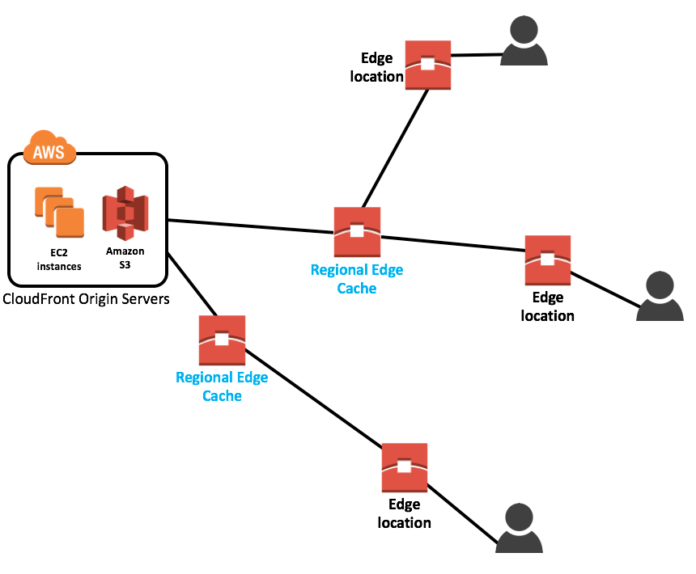
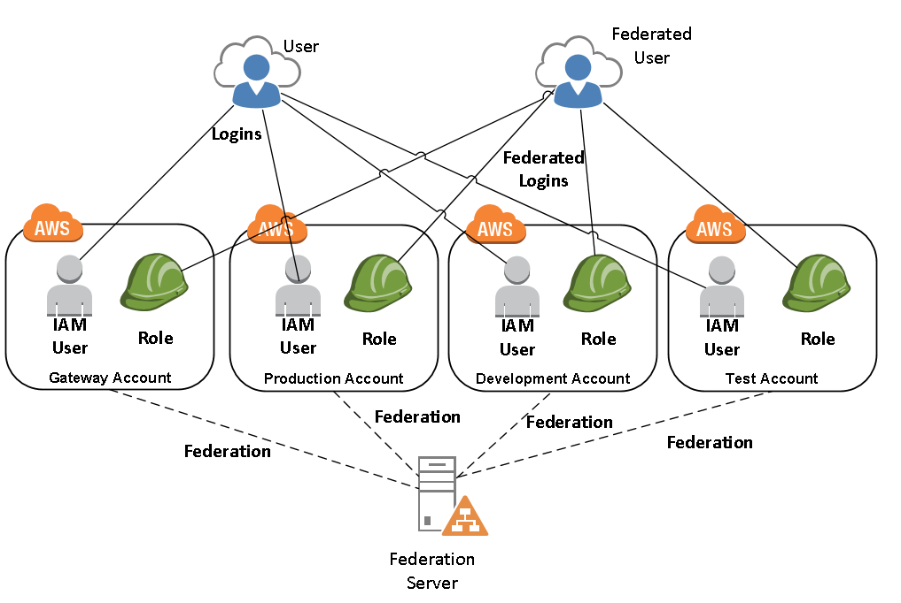

Index Topics

 > I’ve always been a software engineer. I used to have a general understanding of what Data Science and Analytics were. **What I didn’t know** was how **important it is** for the data **to respect a few requirements in order to be used effectively**, and how engineers can help make the data readily accessible.
 [*](https://medium.com/bolt-labs/want-to-be-a-data-engineer-heres-what-you-need-to-know-68f7575dc6d8)

* AWS Stuffs
  * History:
    * > Inventions requires two things: 1. The ability to try a lot of experiments and 2. Not to having to live with the collateral damages of failed experiments. Andy Jassy
  * Services overview
  
  * Core concepts
    * The oldest region is the US East (Virginia) and this is where all the news services come out first
    * Availability zone vs Region vs Edge location
    * Global Infrastruture
    
    * Availability Zone is essentially a big data center each with redundant power, networking and connectivity and etc.
    * Availability Zone may have a lot of data center but cuz them are so close, they counted as 1 AZ.
    
    * Region is a geografical area, each region has 2 or more AZ
    
    * Region is a physical location spread across the globe to host your data to reduce **latency**.
    
    * Edge Location are used for caching content
    
    * Edge Location are located in most of the major cities around the world and are specifically used by CloudFront(Content Delivery Network - CDN) to distribute content to end user to reduce **latency**.
    
    * There are more Edge Location than Regions.
  * IAM (Identity and Access Management)
    
    * Everything you do here is in global region, itsn't belong to a one specific region.
    * Enables you to manage users and their level of access for aws stuffs.
    * Enables you to manage access to AWS services and resources securely. Using IAM, you can create and manage AWS users and groups, and use permissions to allow and deny their access to AWS resources. 
    * Features[*](https://info.acloud.guru/team-cloud-technology-training?adchannel=Google&paidcampaign=1648420462&paidadgroup=64616557178&paidkeyword=kwd-411849373105&paidad=315261896152&gclid=EAIaIQobChMIpseVr-394QIVCCaGCh1zSQNmEAAYASAAEgIr8PD_BwE):
      * Shared Access to your AWS Account
      
      * Centralised Control of your AWS Account
      
      * **Granular** Permission 
      * **Identity Federation** (Active Diretory, Facebook, Linkedin etc)
      * **Multifactor Authentication**
      * Provide temporary access for users/devices and services where necesssary
      * Allows you to set up your own password **rotation policy**
      * Integrates with many different AWS services
      * Support **PCI DSS Compliance** 
    *  ARN (TODO)
    * Users, groups, policies and roles
      * > AWS Identity and Access Management (IAM) is a web service that helps you securely control access to AWS resources for your users. You use IAM to control who can use your AWS resources (authentication) and what resources they can use and in what ways (authorization).[*](https://serverless-stack.com/chapters/what-is-iam.html)
      * >When you first create an AWS account, you are the **root user**. The email address and password you used to create the account is called your root account credentials. You can use them to sign in to the AWS Management Console. When you do, **you have complete, unrestricted access to all resources in your AWS account**, including access to your billing information and the ability to change your password.[*](https://serverless-stack.com/chapters/what-is-iam.html)
      * Users
        * Users as people, organizations or something like that, and IAM user consists of a name, a password to sign into a AWS console. (Remember, doesn't a good pratice give your root creadencials for someone, that's why you will prefer to create IAM users). 
        * By default users can't access anything in your account then you will to create policies to the users. 
        
        * New users are assigned **Access Key ID** and **Secret Access Key** when first created.
        * These are not the same as a password, you cannot use **Access Key ID** and **Secret Access Key** to login into the console, you just can use theses to access API's and Command Line.
      * Policies
        * Polices as essential documents theses documents are in a format called JSON and they give permissions as to what a User, Group or Role is able to do.  
        * You can to attach a policy to a user, a role or a group.
        * ***Here a policy that grants all operations to all S3 buckets:***
            ```
            {
                "Version": "2012-10-17",
                "Statement": {
                    "Effect": "Allow",
                    "Action": "s3:*",
                    "Resource": "*"
                }
            }
            ```
        * ***Here a policy that grants more granular access, only allowing retrieval of files prefixed by the string Alanes- in the bucket called Hello-World***:
            ```
                {
                    "Version": "2012-10-17",
                    "Statement": {
                        "Effect": "Allow",
                        "Action": ["s3:GetObject"],
                        "Resource": "arn:aws:s3:::Hello-World/*",
                        "Condition": {"StringEquals": {"s3:prefix": "Alanes-"}}
                    }
                }
            ``` 
        * An IAM policy is **a rule** or **set of rules** defining the operations **allowed/denied** to be performed on **an AWS resource.**
      * Roles
        * Roles are permitions for resources. 
        
        * > Sometimes your **AWS resources need to access other resources** in your account. For example, you have a **Lambda function that queries your DynamoDB** to retrieve some data, process it, and then send Bob an email with the results. In this case, **we want Lambda to only be able to make read queries** so it does not change the database by mistake. We also want to restrict Lambda to be able to email Bob so it does not spam other people. **While this could be done by creating an IAM user and putting the user’s credentials to the Lambda function or embed the credentials in the Lambda code, this is just not secure.** If somebody was to get hold of these credentials, they could make those calls on your behalf. This is where IAM role comes in to play.[*](https://serverless-stack.com/chapters/what-is-iam.html)
        * A role does not have any credentials (password or access keys) associated with it
        * You need to associate policies for your roles.
        * Roles can be applied for Users.
        * > You can also have** a role tied to the ARN of a user from a different organization**. This allows the external user to assume that role as a part of your organization. **This is typically used when you have a third party service that is acting on your AWS Organization**. You’ll be asked to create a Cross-Account IAM Role and **add the external user as a Trust Relationship**.** The Trust Relationship is telling AWS that the specified external user can assume this role**.
        
      * Groups
        * A bunch of users then each user in the group automatically has the permissions that are assigned to the group 
        * >  **If a new user joins your organization** and should have administrator privileges, you can assign the appropriate permissions by adding the user to that group. Similarly, if a person changes jobs in your organization, instead of editing that user’s permissions, you can remove him or her from the old groups and add him or her to the appropriate new groups.
        
      * MFA
        * > AWS Multi-Factor Authentication (MFA) **is a simple best practice that adds an extra layer of protection on top of your user name and password**. With MFA enabled, when a user signs in to an AWS website, **they will be prompted for their user name and password (the first factor— what they know)**, as well as for **an authentication response from their AWS MFA device (the second factor— what they have).** Taken together, these multiple factors provide increased security for your AWS account settings and resources. 
        You can enable MFA for your AWS account and for individual IAM users you have created under your account. MFA can be also be used to control access to AWS service APIs.
  * Billing Alarm
    * 
    
    

