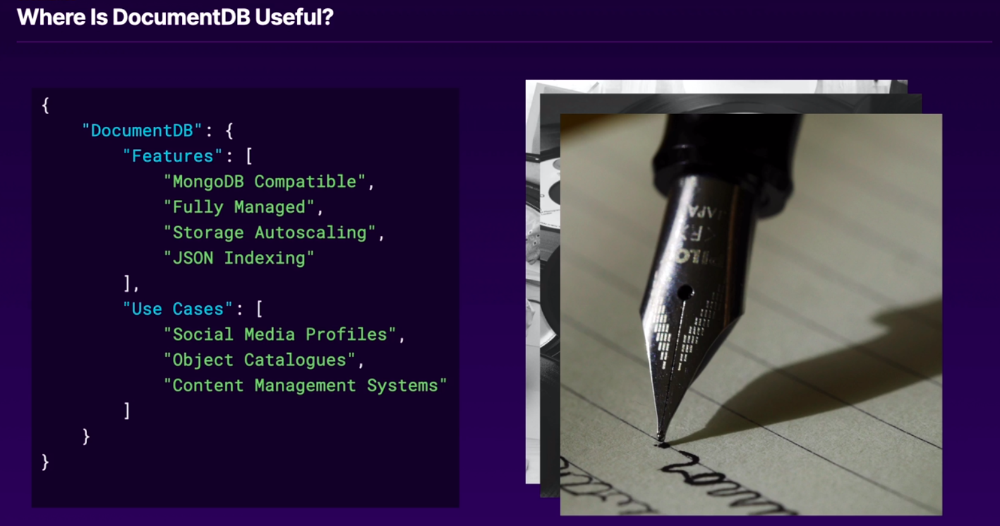

# Table of Contents
1. [Data Flow](#data-flow)


## Data Flow


## Simple Storage Service (S3)

### Overview
S3 uses an object called the bucket (bucket is the atomic unit for s3). 
S3 organizes the data into buckets, it is going to have prefixes and a huge amount of utility.

### Transfer Acceleration 
(Provides a global content **ingestion** network)
Allow us to reduce the latency of upload files for users across the world using AWS Edge locations.
(Cloud front do almost the same, but in case of cloud front, it reduces the latency in
downloading content to users)

* It's enable per bucket
* It has its own endpoints
  - bucketname.s3-accelerate.amazonaws.com
  - bucketname.s3-accelerate.dualstack.amazonaws.com
- It has additional cost
  - $0.04/GB Unit States, Europe, Japan
  - $0.08/GB all other AWS Edge Locations


### S3 Multipart Upload

Uploading a big file to s3
- Single S3 Put can be up to 5GiB
- S3 Objects can be up to 5TiB

So how to upload that?? 

Prepare Data ->
Move Pieces  ->
S3 Puts It Together

There's 3 Multipart Upload API Calls
- Create MultipartUpload
- UploadPart
- CompleteMultipartUpload

Considerations

- Parts in Multipart uploads can be made up to 10000 parts
- Specifying the same part number as a previously uploaded part can be utilized to overwrite that part
- A bucket lifecycle policy that can be utilized to automatically abort multipart uploads
after a specified time period.

Best Practices
- Utilize Multipart Upload for files larger than 100MiB
- All parts except the final part must be at least 5MiB

So parts should be between 5MiB and 100MiB

### S3 Storage Classes 

A bucket for every use case


All these Nines!

- **Durability**: Eleven 9's 99.999999999%
- **Availability**: Two to Four 9's - 99.5% to 99.99%

Service Level Agreement (SLA)
- **Availability**: Two to Three 9's - 99% to 99.9%

Deep Overview

#### S3 Standard Class


#### S3 Infrequent Access

We might use Standard to the Data Collection Bucket, but use Infrequent Access Bucket to 
bucket which hold the data after the processing flow. 


**Infrequently Accessed Data**

- [!!] Additional Data Write Charge - $0.01 per 1000 requests
- [!!] Additional Data Retrieval Charge - $0.01 per GB
- [!] Objects smaller than 128KB are billed as 128KB objects


#### Standard Infrequent Access vs One Zone Infrequent Access

- Standard IA - 3 or more Availability Zones - $0.0125 per GB stored
- One Zone IA - 1 Availability Zone          - $0.0100 per GB stored

Design

- **Durability**: Eleven 9's 99.999999999%
- **Availability**: Three 9's - 99.9%

Service Level Agreement (SLA)
- **Availability**: Two 9's - 99%

#### S3 Intelligent-Tiering

Objects with Intelligent-Tiering enabled will be monitored for access.


#### S3 Glacier


#### S3 Glacier Deep Archive

Haw fast do you need that data?
- Data retrieved within 12 hours

It costs how much to store a GB?
- Lowest storage cost of S3 storage classes $0.00099/GB

#### S3 Life cycle policies


Example:

```
// aws s3api put-bucket-lifecycle-configuration --bucket demo --lifecycle-configuration
file://ArchivePolicy.json

{
  "Rules": [
    {
      "Filter": {
        "Prefix": "logs/"
      },
      "Status": "Enabled",
      "Transitions": [
        {
          "Days": 30,
          "StorageClass": "STANDARD_IA"
        },
        {
          "Days": 120,
          "StorageClass": "DEEP_ARCHIVE"
        }
      ],
      "Expiration": {
        "DAYS": 2555
      },
      "ID": "ApplicationLogArchiving"
    }
  ]
}
```

Storage Classes can be: 
- STANDARD
- REDUCED_REDUNDANCY
- STANDARD_IA
- ONEZONE_IA
- INTELLIGENT_TIERING
- GLACIER
- DEEP_ARCHIVE

### S3 Security and Encryption

**In Flight Security**

- Mandatory TLS
- VPC Endpoints
- VPN 
- Access Control 
- Auditing

**At Rest Security**
- Client Side Encryption
- SDKs
- Server Side Encryption KMS

**Client Side Encryption**
- KMS holds the key
- Key identifier Stored with Object

**Server Side Encryption**
- Several options depending on secutoru requirements

If you've got any deny, so you are not allowed to call s3 api.

Waterfall Rules:
- Implicit Deny is default
- Explicit Allow beats implicit Deny
- Explicit Deny beats Explicit Allow


**Object Protection and Replication**

Protection:
- Object Locking 
- Write Once Read Many (WORM mode)
- Multi-factor authentication (MFA) Delete
- Versioning

Replication:
- cross-region replication (This provides us a Disaster Recovery in case there is loss of entire AWS region)

### S3 Cross-Region Replication

When to use Cross-Region Replication

S3 Cross-Region Replication (CRR) is used to copy objects across Amazon S3 buckets in different AWS Regions. 

CRR can help you do the following:

**Meet compliance requirements** 
- Although Amazon S3 stores your data across multiple geographically distant Availability Zones by default, compliance requirements might dictate that you store data at even greater distances. Cross-Region Replication allows you to replicate data between distant AWS Regions to satisfy these requirements.

**Minimize latency** 
- If your customers are in two geographic locations, you can minimize latency in accessing objects by maintaining object copies in AWS Regions that are geographically closer to your users.

**Increase operational efficiency**
- If you have computed clusters in two different AWS Regions that analyze the same set of objects, you might choose to maintain object copies in those Regions.

### Cross Replication vs Transfer Acceleration:

If the core requirement is to increase performance (for either GET or PUTs), regardless of the location of the client/consumer, then S3 Transfer Acceleration makes more sense than Cross-Region Replication since its effectively using CloudFront to cache data on the edge and if there is a cache miss, marshal traffic over the AWS backbone network to increase performance.  There is no replication of data with S3 Transfer Acceleration and cached data has a TTL which means it will expire at some stage.

If the core requirement is to protect against a regional outage, or even to ensure that changes to a primary bucket (including the deletion of objects and their versions) are recorded, then CRR would be a good bet (since deletes are not replicated).  Additionally, you can even replicate buckets to the same region now (although this is a relatively new capability) and you can also replicate across accounts, which you can use to ensure that anybody in the source account definitely can’t mess with the replicated data.

### S3 Labs

```
import boto3
import json

def get_data():
    s3_bucket = 'random-users-data-595554608951'
    
    data = []
    
    s3 = boto3.client('s3')
    objects = s3.list_objects_v2(Bucket = s3_bucket)['Contents']
    
    s3_keys = []
    for object in objects:
        if object['Key'].startswith('users_'):
            s3_keys.append(object['Key'])
            
    for key in s3_keys:
        object = s3.get_object(Bucket=s3_bucket, Key=key)
        
        object_data = json.loads(object['Body'].read())
        data += object_data
    
    return data

def handler(event, context):
    # Call the "get_data" function and return appropriately formatted results.
    return {'isBase64Encoded': False,'statusCode': 200,'body': json.dumps(get_data()), 'headers': {"Access-Control-Allow-Origin": "*"}}
``` 

## Databases in AWS

### Database Engine Types

### RDS

We don't have access to system operational, instead of it, we have API access in order to manage these instances.


#### RDS is a second level service

It means that others AWS Services are used to build the RDS service. 


#### How do we manage these instances?

Using configuration


#### Disaster Recovery

We achieve that doing Multi-AZ deployments, so we have a primary and a secondary instance,
in us-west-2a and us-west-2b, these instances are going to be replicated at the block level (EBS),
so the RDS engine is not involved at all. 

In the secondary instance, the database engine is in idle, but in case of any lost in primary (engine, ec2 or ebs fails)
the secondary will be awake up and became the primary, then a new secondary will be created in another AZ.

This process takes about 60 seconds most of the time to run.


## Neptune

We have edge, node, and data in an Graph database, we need these in order to transverse this graph and collect data.


There are two interface languages:

- Apache - TinkerPop Gremlin
  - Graph Structure: Property
  - Interface: Websocket
  - Query Pattern: Traversal
- W3C - SPARQL Protocol and RDF Query Language
  - Graph Structure: Resource Description Framework (RDF)
  - Interface: HTTP Rest
  - Query Pattern: SQL


#### RDS vs Neptune


## Document DB

Document Store Database Management System. It's MongoDB compatible, it is compatible, it isn't MongoDB.



## Serverless Options

- S3
  - S3 provides a SelectObjectContent API Call
- Athena
  - A fully RDMS service backed by S3
- DynamoDB
  - Key:Value+ Fully managed serverless database
- Aurora Serverless
  - Leveraging Aurora architecture allows clusters to become cold while persisting cluster storage

### S3 Select


### Athena

Service Integration: Quicksight, Glue


### DynamoDB


### Aurora Serverless


