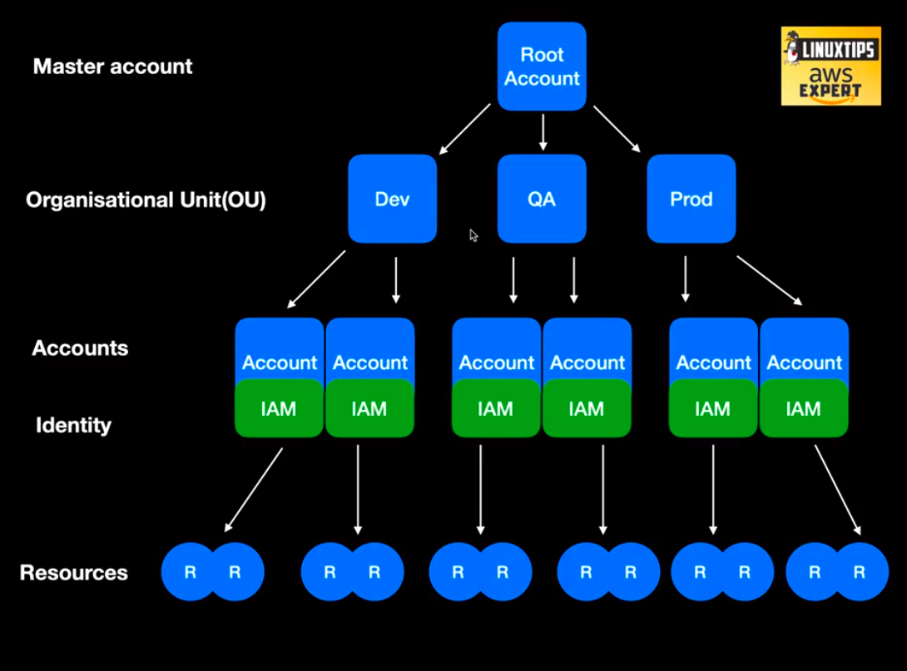

## Cloud Concepts

### General Characteristics and Advantages

- Agility
- Maintenance
- Reliability 
- Security
- Performance
- Scalability
- Cost and Elasticity

### According to NIST (National Institute of Standards and Tech)

- On demand self-service
- Broad network access
- Resource pooling
- Rapid elasticity
- Measured service

### Service Models

- IaaS (Infrastructure as a Service), ec2, RDS, etc... 
- PaaS (Platform as a Service), heroku
- FaaS (Function as a Service), lambda

### Deployment models

- Private Cloud (this is yours, created only for you/company, internal)
- Public Cloud (aws, gcp, azure, everyone can use it, that platform)
- Hybrid Cloud (you're using public and private cloud in your company)
- Multi Cloud 
- Community

## Foundation

Root Account
- Principal account, the difference between this account and others ones is because you usually use this account to manage others. The billing should be here, for instance.

Organisational Unit (OU)
- The main responsibility of this is keep in order your accounts, and a way to apply rules for organizations

