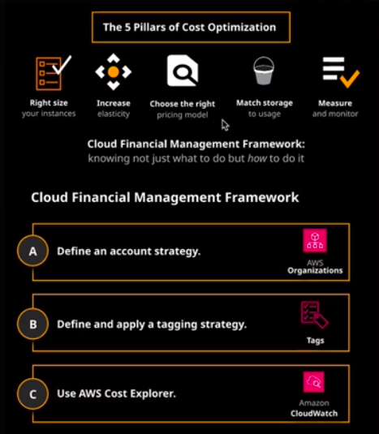
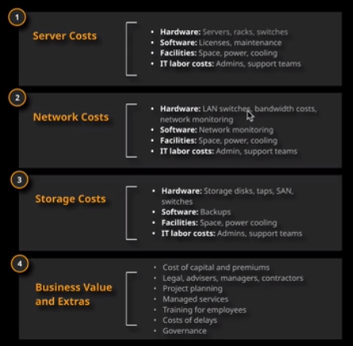
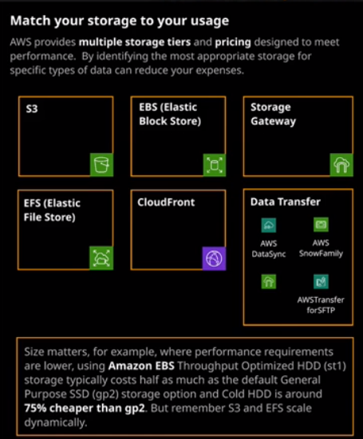
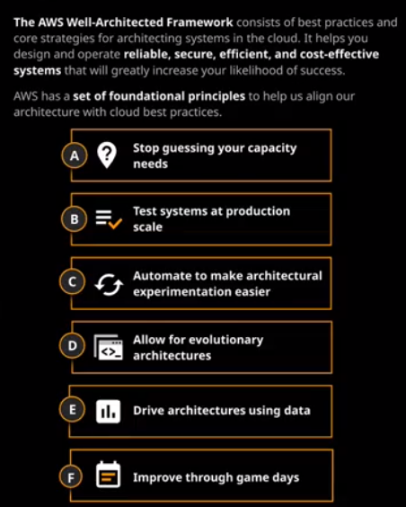
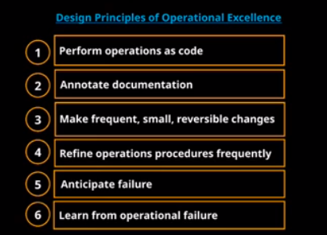
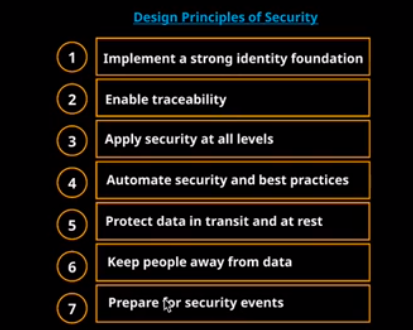
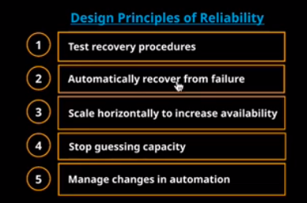
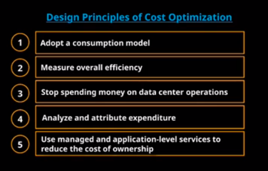

## Cost Optimization

What is Cost Optimization?

The most important practice for effectively optimizing costs in AWS is to start early. 
Start implementing cost optimization practices in small environments, and as you grow, 
create new operational best practices, automation, and organizational incentives.

### TCO (Total Cost Ownership)

It is a projection of the direct and indirect costs of purchasing a product or service;

Now AWS keep active only the: https://calculator.aws/#/

### AWS Cost Optimization

1. Optimized Lift-and-Shift with AWS Cost Optimization
- Right Sizing
- Elasticity
- Storage Optimization

2. Re-Platformed AWS Optimized Infrastructure
- Measure, Monitor, Improve
- Serverless
- AWS Managed Services

### Cost optimization Pillars
1. Right Sizing
- Selects the cheapest instance available that meets your performance requirements
- Look at your utilization of CPU, RAM, storage, network, etc. to identify instance that could be downsized
- Use CloudWatch to track metrics and set up alarms to react dynamically
2. Increasing Elasticity
- Auto Scaling
- AWS Instance Scheduler
- Enforce Tagging Strategy
3. Choose the Right Pricing Model
- Use Cost Explorer
- Use Trusted Advisor
- Design using Cost Conscious Designs
4. Match Your Storage to Your Usage

5. Measure, and Monitor
- AmazonCloudWatch
- CostExplorer
- Aws Well-Architected Tool
- Aws Trusted Advisor

### Well-Architected Framework

1. Operational Excellence
The ability to run and monitor systems to continually improve your business value and to support processes and procedures.

2. Security
The ability to protect your information, systems, and assets through risk assessment and mitigation strategies.

3. Reliability
The ability of a system to recover from infrastructure or service disruptions, acquiring resources to meet demand, and mitigating disruptions.

4. Performance Efficiency
The ability to use computing resources efficiently to meet system requirements while demands change and technologies evolve.

5. Cost Optimization
The ability to run systems to deliver business value at the lowest price

