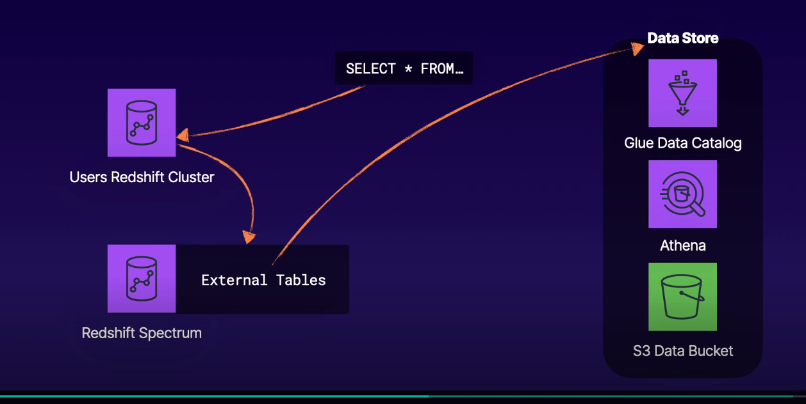
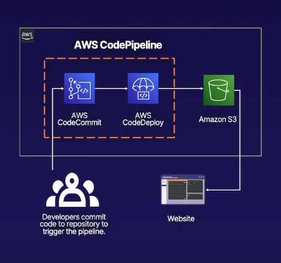

### Linux Academy Hands On
1. Querying Data from Multiple Redshift Spectrum Tables



- SpectrumRole with S3Access and GlueAccess
- [External Table Create](https://github.com/linuxacademy/Content-AWS-Certified-Data-Analytics---Speciality/blob/master/Lab_Assets/querying_data_from_multiple_redshift_spectrum_tables/solution.sql)
1. Data Analytics with Spark and EMR

[Github](https://github.com/linuxacademy/Content-AWS-Certified-Data-Analytics---Speciality/tree/master/Data_Analytics_with_Spark_and_EMR)

3. Querying Data in Amazon S3 with Amazon Athena
```
MSCK REPAIR TABLE aws_service_logs.cf_access_optimized
```

4. Loading Data into a Redshift Cluster
5. Working with a DevOps CI/CD Pipeline in AWS
6. Building a CI/CD Pipeline with AWS CodePipeline to Deploy a Static Website on S3. [Github](https://github.com/natonic/Developer-Tools-Deep-Dive/tree/master/Labs/PipelineToStaticS3)

7. Introduction to AWS Identity and Access Management (IAM)
8. Creating a Basic Amazon S3 Lifecycle Policy
9. Creating Amazon S3 Buckets, Managing Objects, and Enabling Versioning
10. Building a Three-Tier Network VPC from Scratch in AWS
11. Troubleshooting AWS Network Connectivity: Security Groups and NACLs
12. Performing Real-Time Data Analysis with Kinesis
    1. https://github.com/linuxacademy/content-aws-mls-c01/tree/master/PerformRealTimeDataAnalysisWithKinesis