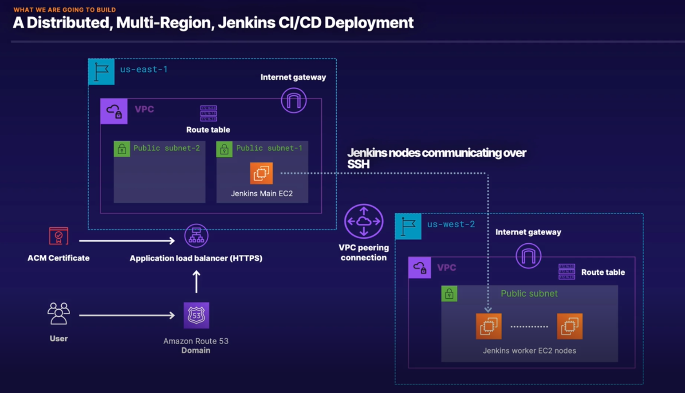

### Terraform 

The purporse of terraform is infrastructure automation and it is **Cloud Agnostic** (it is not tied into one cloud vendor) and work across all popular cloud providers. (AWS/CGP/Azure)
It is easy to write and has **declarative templates** in HCL (Hashcorp configuration language).
It is necessary to keep track of infrastructure throught **local or remote state files** and it is user responsability to keep it safe and in back up.

HCL offers built-in functions and bast array of modules and provides for working with cloud and on-prem systems.

Also It is **Agentless**, it means, only needs a self-contained Terraform binary installed in the target system.

### CloudFormation

IaC for AWS and has templates in JSON and YAML, CF keeps track of deployment by itself, **user does not need to worry about**. It is easy to write and it is **declarative**. Offers built-in functions and cross organization deployments. 

Also It is **Agentless**, the services lives in the AWS Cloud.

### Ansible

A hybrid **config management** and **orchestration tool**, it has playbooks written in YAML. It required to keeps track of deployments using playbook tasks. It is also **procedural** (ad hoc) **but have declarative modules too.** 

It offers a vast array of modules for every OS-level utility as well as cloud and on-prem infrastructure vendors.

Also it is **Agentless**, accesses cloud vendor APIs for infra deployment and SSH for managing OS.

### Terraform popular commands

- Terraform init
Initializes working directory
Needs to be run before deploying infrastructure 
Syncs config, safe to run (Configures backend for storing infrastructure state and does not modify or delete any existing configuration or state)

- Terraform fmt
Format templates for readability
Helps in keeping code cosistent
Safe to run at any time (Does not modify or add anything to code; only reformats it and rewrites it backs to the files)

- Terraform validate
Validate config files (check for syntax mistakes and integral consistency: typos and misconfigured resources)
Needs terraform init 
Safe to run at any time

- Terraform plan
Create a execution plan (Calculates the delta between required state and current state to create an execution plan)
Fail-safe before actual deployment
Execution plan can be saved using the -out flag (Be aware that sensitive configuration items would also be saved in a file as plantext)

- Terraform deploy
Deploy the execution plan!
By default will prompt before deploying 
Will display the execution plan again

### Terraform backends

By default, state is stored on local disk.
Variables cannot be used as input to Terraform block.

terraform {
    required_version = ">=0.12.0"
    backend "s3" {
        
    }
}