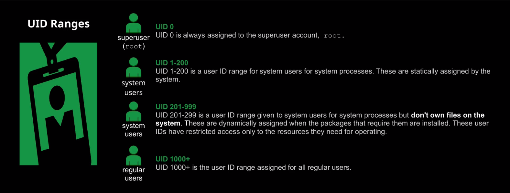

## User Management



### What is the Linux User Account?

User accounts provide access to the Linux system, and all activities in that system are owned and managed by user accounts. 

That means the system processes are also owned and ran by specific users.

There are three kinds of users in Linux:
* System Account (Service Account)
* Regular User Account 
* Super-User Account

The UID (User Identifier) is a numeric value to identify users in the system.

The GID (Group Identifier) is a numeric value to identify groups in the system.

The system assigns the UID and the GID, and those determine which resources a user or a group of users has access to

```
# check user's id
$ id 

# check user's groups
$ groups 
```

### What is a group?
A group is just a collection of user accounts who share the same access. Users can be added to a group to obtain privileges to files, directories, and so on

### Files

```
Holds every user on the system and also their attributes, except the password
$ cat /etc/passwd

The user password is actually encrypted into
$ cat /etc/shadow

The group information is stored into
$ cat /etc/group

The group password is actually encrypted into
$ cat /etc/gshadow
```

## Deep Dive into [/etc/files]((https://learning.lpi.org/pt/learning-materials/010-160/5/5.2/5.2_01/))

### /etc/passwd

example: frank:x:1001:1001::/home/frank:/bin/bash

Each line has seven items delimited by : 
user_name:user_password:UID:GID:GECOS:home_directory:shell

### /etc/group

example: developer:x:1002:

Each line has four items delimited by : 
group_name:group_password:GID:list_members_in_group

### /etc/shadow
example: frank:$6$i9gjM4Md4MuelZCd$7jJa8Cd2bbADFH4dwtfvTvJLOYCCCBf/.

Each line has nine items delimited by : 
jYbK1IMYx7Wh4fErXcc2xQVU2N1gb97yIYaiqH.jjJammzof2Jfr/:18029:0:99999:7:::
user_name:user_encrypt_password:last_changed_password_date:min_password_age:max_password_age:days_until_pass_expires:days_until_account_became_inactive:date_account_will_be_expired:future_use

### /etc/gshadow

Each line has nine items delimited by : 
group_name:group_encrypt_password:list_admins_in_group:list_members_in_group


### What is a Shell?

A shell is a program that acts as an interface between the user and the operating system kernel. A shell is started each time a user logs in and is responsible for executing programs based on user input. The shell also provides a user environment that can be customized by configuring the profile initialization files for each user. These files contain user settings for:

- Paths where commands are located
- Defining variable
- Customizable values, such as terminal prompt

### Available Shells
- The Bourne Shell (/bin/sh)
- The Korn Shell (/bin/ksh)
- The C Shell (/bin/csh)
- The Bourne-Again Shell (/bin/bash)

This above shell's are generelly used for service accounts that run system processes and don't require a user to login.

User shell set to /sbin/nologin when a user try to login it will get a "this account is currently no available"

User shell set to /bin/false when a user try to login is immediately logged out.

### User Home Directories

Each user on a Linux system is created with a user home directory. It stores user's file, directories and executables. (~ or $HOME)

/etc/login.defs contains default configuration about user creation
/etc/skel contains files and directories that are copied over to a new user's home directory when it is created with the **useradd** command.

```

# USER CREATION
$useradd alane
$ su alane
$ ls -a $HOME
.  ..  .bash_logout  .bash_profile  .bashrc
$ useradd -c "Jane Doe" -d /home/jane -m -g wheel -G adm -p abc1234567 -s /bin/bash -u 2000 jdoe
$ useradd -c "John Smith" -d /home/john -m -g wheel -G adm -p abc1234567 -s /bin/sh -u 2001 jsmith
$ grep jdoe /etc/passwd
jdoe:x:2000:10:Jane Doe:/home/jane:/bin/bash
$ grep 10 /etc/group
wheel:x:10:
$ usermod -G users jdoe # changing the primary group
$ grep jdoe /etc/group
users:x:100:jdoe
$ usermod -G test -a jdoe # adding a secondary group
$ grep jdoe /etc/group
users:x:100:jdoe
test:x:1003:jdoe
$ find / -user jsmith
$ userdel -r jsmith
```

```
# GROUP CREATION
[root@a47d39d22036 /]# groupadd -g 30000 appadmin
[root@a47d39d22036 /]# groupadd -g 40000 dba     
[root@a47d39d22036 /]# useradd -g appadmin -G 40000 user1
[root@a47d39d22036 /]# grep user1 /etc/passwd
user1:x:1000:30000::/home/user1:/bin/bash
# THE MAIN GROUP ISNT LISTED INTO /ETC/GROUP (LIST OF MEMBERS)
[root@a47d39d22036 /]# grep user1 /etc/group 
dba:x:40000:user1 
[root@a47d39d22036 /]# grep appadmin /etc/group
appadmin:x:30000:
# Changing the GID and the name of the group
[root@a47d39d22036 /]# groupmod -g 35000 -n appdev appadmin 
[root@a47d39d22036 /]# groupdel appdev  
groupdel: cannot remove the primary group of user 'user1'
[root@a47d39d22036 /]# groupdel dba   
[root@a47d39d22036 /]# groupdel -f appdev
[root@a47d39d22036 /]# grep appdev /etc/group
```

The home directories created for nonroot user can be accessed for the root user. 
```
[root@bf4ea02d58a7 home]# ls
usera
```

Changing the default (home) directory
```
$ usermod -d /usera_new usera
# the directory isnt be create by the command, you need to create manually
$ mkdir /usera_new 
$ ls -ll
drwxr-xr-x   2 root root 4096 Jun 24 10:58 usera_new
# the permissions is not correct, the usera needs to onwer this directory
$ chown usera:usera /usera_new
drwxr-xr-x   2 usera usera 4096 Jun 24 10:58 usera_new
# To change the permission and this way guarantee that just the usera is access to this directory
$ chmod 700 /usera_new 
drwx------   2 usera usera 4096 Jun 24 10:58 usera_new
```

Files in home directories by default (you can add more in /etc/skel):

.bash_logout  : read when user logout
.bash_profile : read when user login
.bashrc       : read every time a user start a new shell

## User Management Tools

