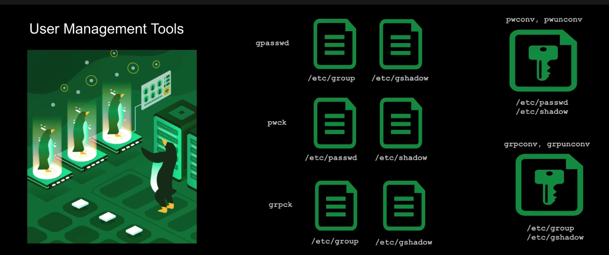
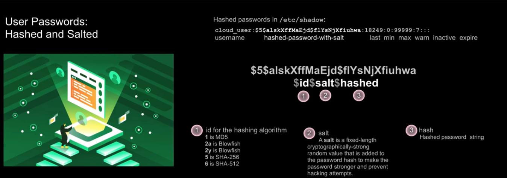
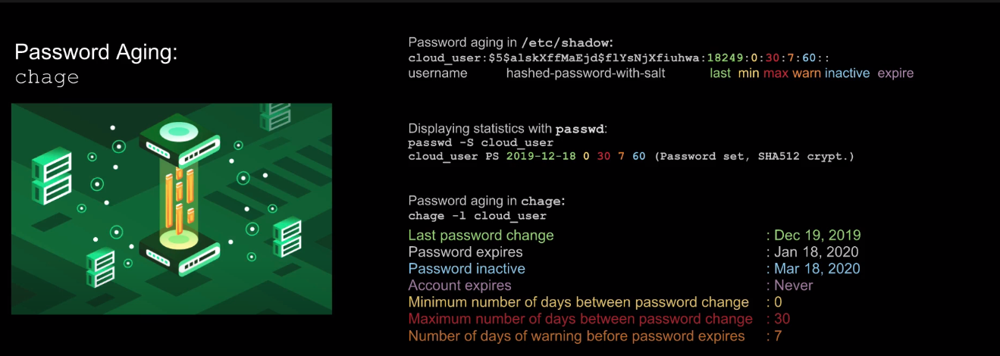

## User Management


### What is the Linux User Account?

User accounts provide access to the Linux system, and all activities in that system are owned and managed by user accounts. 

That means the system processes are also owned and ran by specific users.

There are three kinds of users in Linux:
* System Account (Service Account)
* Regular User Account 
* Super-User Account

The UID (User Identifier) is a numeric value to identify users in the system.

The GID (Group Identifier) is a numeric value to identify groups in the system.

The system assigns the UID and the GID, and those determine which resources a user or a group of users has access to

```
# check user's id
$ id 

# check user's groups
$ groups 
```

### What is a group?
A group is just a collection of user accounts who share the same access. Users can be added to a group to obtain privileges to files, directories, and so on

### Files

```
Holds every user on the system and also their attributes, except the password
$ cat /etc/passwd

The user password is actually encrypted into
$ cat /etc/shadow

The group information is stored into
$ cat /etc/group

The group password is actually encrypted into
$ cat /etc/gshadow
```

## Deep Dive into [/etc/files]((https://learning.lpi.org/pt/learning-materials/010-160/5/5.2/5.2_01/))

### /etc/passwd

example: frank:x:1001:1001::/home/frank:/bin/bash

Each line has seven items delimited by : 
user_name:user_password:UID:GID:GECOS:home_directory:shell

### /etc/group

example: developer:x:1002:

Each line has four items delimited by : 
group_name:group_password:GID:list_members_in_group

### /etc/shadow
example: frank:$6$i9gjM4Md4MuelZCd$7jJa8Cd2bbADFH4dwtfvTvJLOYCCCBf/.

Each line has nine items delimited by : 
jYbK1IMYx7Wh4fErXcc2xQVU2N1gb97yIYaiqH.jjJammzof2Jfr/:18029:0:99999:7:::
user_name:user_encrypt_password:last_changed_password_date:min_password_age:max_password_age:days_until_pass_expires:days_until_account_became_inactive:date_account_will_be_expired:future_use

### /etc/gshadow

Each line has nine items delimited by : 
group_name:group_encrypt_password:list_admins_in_group:list_members_in_group


### What is a Shell?

A shell is a program that acts as an interface between the user and the operating system kernel. A shell is started each time a user logs in and is responsible for executing programs based on user input. The shell also provides a user environment that can be customized by configuring the profile initialization files for each user. These files contain user settings for:

- Paths where commands are located
- Defining variable
- Customizable values, such as terminal prompt

### Available Shells
- The Bourne Shell (/bin/sh)
- The Korn Shell (/bin/ksh)
- The C Shell (/bin/csh)
- The Bourne-Again Shell (/bin/bash)

This above shell's are generelly used for service accounts that run system processes and don't require a user to login.

User shell set to /sbin/nologin when a user try to login it will get a "this account is currently no available"

User shell set to /bin/false when a user try to login is immediately logged out.

### User Home Directories

Each user on a Linux system is created with a user home directory. It stores user's file, directories and executables. (~ or $HOME)

/etc/login.defs contains default configuration about user creation
/etc/skel contains files and directories that are copied over to a new user's home directory when it is created with the **useradd** command.

```

# USER CREATION
$useradd alane
$ su alane
$ ls -a $HOME
.  ..  .bash_logout  .bash_profile  .bashrc
$ useradd -c "Jane Doe" -d /home/jane -m -g wheel -G adm -p abc1234567 -s /bin/bash -u 2000 jdoe
$ useradd -c "John Smith" -d /home/john -m -g wheel -G adm -p abc1234567 -s /bin/sh -u 2001 jsmith
$ grep jdoe /etc/passwd
jdoe:x:2000:10:Jane Doe:/home/jane:/bin/bash
$ grep 10 /etc/group
wheel:x:10:
$ usermod -G users jdoe # changing the primary group
$ grep jdoe /etc/group
users:x:100:jdoe
$ usermod -G test -a jdoe # adding a secondary group
$ grep jdoe /etc/group
users:x:100:jdoe
test:x:1003:jdoe
$ find / -user jsmith
$ userdel -r jsmith
```

```
# GROUP CREATION
[root@a47d39d22036 /]# groupadd -g 30000 appadmin
[root@a47d39d22036 /]# groupadd -g 40000 dba     
[root@a47d39d22036 /]# useradd -g appadmin -G 40000 user1
[root@a47d39d22036 /]# grep user1 /etc/passwd
user1:x:1000:30000::/home/user1:/bin/bash
# THE MAIN GROUP ISNT LISTED INTO /ETC/GROUP (LIST OF MEMBERS)
[root@a47d39d22036 /]# grep user1 /etc/group 
dba:x:40000:user1 
[root@a47d39d22036 /]# grep appadmin /etc/group
appadmin:x:30000:
# Changing the GID and the name of the group
[root@a47d39d22036 /]# groupmod -g 35000 -n appdev appadmin 
[root@a47d39d22036 /]# groupdel appdev  
groupdel: cannot remove the primary group of user 'user1'
[root@a47d39d22036 /]# groupdel dba   
[root@a47d39d22036 /]# groupdel -f appdev
[root@a47d39d22036 /]# grep appdev /etc/group
```

The home directories created for nonroot user can be accessed for the root user. 
```
[root@bf4ea02d58a7 home]# ls
usera
```

Changing the default (home) directory
```
$ usermod -d /usera_new usera
# the directory isnt be create by the command, you need to create manually
$ mkdir /usera_new 
$ ls -ll
drwxr-xr-x   2 root root 4096 Jun 24 10:58 usera_new
# the permissions is not correct, the usera needs to onwer this directory
$ chown usera:usera /usera_new
drwxr-xr-x   2 usera usera 4096 Jun 24 10:58 usera_new
# To change the permission and this way guarantee that just the usera is access to this directory
$ chmod 700 /usera_new 
drwx------   2 usera usera 4096 Jun 24 10:58 usera_new
```

Files in home directories by default (you can add more in /etc/skel):

.bash_logout  : read when user logout
.bash_profile : read when user login
.bashrc       : read every time a user start a new shell

## User Management Tools


```
[root@bbdf6618f605 /]# grep users /etc/group
users:x:100:

[root@bbdf6618f605 /]# gpasswd users
Changing the password for group users
New Password: 
Re-enter new password: 

[root@bbdf6618f605 /]# grep users /etc/gshadow
users:$6$QDCIx/Dns$7psb4a5o679IDnBwHrOaU0pDR9CoVxWG6u9UdhOzQLIzDOWe.AWtYluf1B/lHG0jiNd44.Jgw/xSrjtEh7t6t.::

[root@bbdf6618f605 /]# gpasswd -r users
[root@bbdf6618f605 /]# grep users /etc/gshadow
users:::

[root@bbdf6618f605 /]# useradd alane
[root@bbdf6618f605 /]# useradd totolfa
[root@bbdf6618f605 /]# gpasswd -M alane,totolfa users
[root@bbdf6618f605 /]# grep users /etc/group # Added as a secondary group
users:x:100:alane,totolfa

[root@bbdf6618f605 etc]# ls -al /etc/ | grep passwd
-rw-r--r--  1 root root    789 Jul  6 10:33 passwd
-rw-r--r--  1 root root    744 Jul  6 10:33 passwd-
[root@bbdf6618f605 etc]# ls -al /etc/ | grep shadow 
----------  1 root root    354 Jul  6 10:33 gshadow
----------  1 root root    341 Jul  6 10:33 gshadow-
----------  1 root root    488 Jul  6 10:33 shadow
----------  1 root root    458 Jul  6 10:33 shadow-
[root@bbdf6618f605 etc]# pwunconv 
[root@bbdf6618f605 etc]# ls -al /etc/ | grep passwd
-rw-r--r--  1 root root    800 Jul  6 10:49 passwd
-rw-r--r--  1 root root    789 Jul  6 10:33 passwd-

[root@bbdf6618f605 etc]# ls -al /etc/ | grep shadow
----------  1 root root    354 Jul  6 10:33 gshadow
----------  1 root root    341 Jul  6 10:33 gshadow-
----------  1 root root    458 Jul  6 10:33 shadow-

[root@bbdf6618f605 etc]# pwconv 
[root@bbdf6618f605 etc]# ls -al /etc/ | grep shadow
----------  1 root root    354 Jul  6 10:33 gshadow
----------  1 root root    341 Jul  6 10:33 gshadow-
-r--------  1 root root    514 Jul  6 10:51 shadow
----------  1 root root    458 Jul  6 10:33 shadow-
```

## Creating Linux Users and Groups
```
[root@bbdf6618f605 etc]# groupadd appusers
[root@bbdf6618f605 etc]# useradd -u 2001 -c "Admin Account for ABC Application" -g appusers appuser1
[root@bbdf6618f605 etc]# useradd -u 2002 -c "Admin Account for ABC Application" -g appusers appuser2
[root@bbdf6618f605 etc]# grep appuser /etc/passwd
appuser1:x:2001:1002:Admin Account for ABC Application:/home/appuser1:/bin/bash
appuser2:x:2002:1002:Admin Account for ABC Application:/home/appuser2:/bin/bash
[root@bbdf6618f605 etc]# grep 1002 /etc/group
appusers:x:1002:
```

## Linux User Management: Modifying User Settings and Removing Groups

```
[root@bbdf6618f605 etc]# groupadd dbadmin
[root@bbdf6618f605 etc]# useradd -u 2003 -c "" -g dbadmin dbadmin
[root@bbdf6618f605 etc]# grep dbadmin /etc/passwd
dbadmin:x:2003:1003::/home/dbadmin:/bin/bash

[root@bbdf6618f605 etc]# usermod -s /sbin/nologin dbadmin
[root@bbdf6618f605 etc]# grep dbadmin /etc/passwd
dbadmin:x:2003:1003::/home/dbadmin:/sbin/nologin


[root@bbdf6618f605 etc]# grep dba /etc/group
dbadmin:x:1003:

[root@bbdf6618f605 etc]# groupadd dba
[root@bbdf6618f605 etc]# grep dba /etc/group
dbadmin:x:1003:
dba:x:1004:

root@bbdf6618f605 etc]# usermod -g dba dbadmin
[root@bbdf6618f605 etc]# grep dbadmin /etc/passwd
dbadmin:x:2003:1004::/home/dbadmin:/sbin/nologin
[root@bbdf6618f605 etc]# grep dba /etc/group 
dbadmin:x:1003:
dba:x:1004:

[root@bbdf6618f605 etc]# ls /home/
dbadmin

[root@bbdf6618f605 etc]# mkdir /home/dba/
[root@bbdf6618f605 etc]# ls -al /home | grep dba
drwxr-xr-x 2 root     root     4096 Jul  7 10:47 dba
drwx------ 2 dbadmin  dba      4096 Jul  7 10:44 dbadmin

[root@bbdf6618f605 etc]# chown dbadmin:dba /home/dba
[root@bbdf6618f605 etc]# ls -al /home | grep dba
drwxr-xr-x 2 dbadmin  dba      4096 Jul  7 10:47 dba
drwx------ 2 dbadmin  dba      4096 Jul  7 10:44 dbadmin

[root@bbdf6618f605 etc]# chmod 740 /home/dba
[root@bbdf6618f605 etc]# ls -al /home | grep dba
drwxr----- 2 dbadmin  dba      4096 Jul  7 10:47 dba
drwx------ 2 dbadmin  dba      4096 Jul  7 10:44 dbadmin

[root@bbdf6618f605 dbadmin]# cp .bash* /home/dba
cp: overwrite '/home/dba/.bash_logout'? yes
cp: overwrite '/home/dba/.bash_profile'? yes
cp: overwrite '/home/dba/.bashrc'? yes

[root@bbdf6618f605 dba]# ls -la
total 20
drwxr----- 2 dbadmin dba  4096 Jul  7 10:54 .
drwxr-xr-x 1 root    root 4096 Jul  7 10:47 ..
-rw-r--r-- 1 root    root   18 Jul  7 10:54 .bash_logout
-rw-r--r-- 1 root    root  141 Jul  7 10:54 .bash_profile
-rw-r--r-- 1 root    root  312 Jul  7 10:54 .bashrc

[root@bbdf6618f605 dba]# chown dbadmin:dba .bash*
[root@bbdf6618f605 dba]# ls -la
total 20
drwxr----- 2 dbadmin dba  4096 Jul  7 10:54 .
drwxr-xr-x 1 root    root 4096 Jul  7 10:47 ..
-rw-r--r-- 1 dbadmin dba    18 Jul  7 10:54 .bash_logout
-rw-r--r-- 1 dbadmin dba   141 Jul  7 10:54 .bash_profile
-rw-r--r-- 1 dbadmin dba   312 Jul  7 10:54 .bashrc

[root@bbdf6618f605 dba]# usermod -d /home/dba dbadmin
[root@bbdf6618f605 dba]# grep dbadmin /etc/passwd
dbadmin:x:2003:1004::/home/dba:/sbin/nologin

[root@bbdf6618f605 home]# rm -R dbadmin/
[root@bbdf6618f605 home]# groupdel dbadmin
```

## Working with Secondary Groups
```
[root@bbdf6618f605 home]# groupadd -g 30000 appadmin
[root@bbdf6618f605 home]# groupmod -g 40000 dba

[root@bbdf6618f605 home]# useradd -g appadmin -G dba user1
[root@bbdf6618f605 home]# useradd -g appadmin -G dba user2
[root@bbdf6618f605 home]# useradd -g appadmin -G dba user3

[root@bbdf6618f605 home]# cd ~
[root@bbdf6618f605 ~]# mkdir /app
[root@bbdf6618f605 ~]# chgrp appadmin /app
[root@bbdf6618f605 ~]# chmod 760 /app/
[root@bbdf6618f605 ~]# ls -al / | grep app
drwxrw----   2 root appadmin 4096 Jul  7 11:27 app

[root@bbdf6618f605 ~]# mkdir /db
[root@bbdf6618f605 ~]# chgrp dba /db 
[root@bbdf6618f605 ~]# chmod 760 /db/
[root@bbdf6618f605 ~]# ls -al / | grep db 
drwxrw----   2 root dba      4096 Jul  7 11:28 db

[root@bbdf6618f605 ~]# echo "This file is reserved for application configuration." > /app/app1.conf
[root@bbdf6618f605 ~]# ls -al /app/app1.conf                                            
-rw-r--r-- 1 root root 53 Jul  7 11:29 /app/app1.conf

[root@bbdf6618f605 ~]# chgrp appadmin /app/app1.conf 
[root@bbdf6618f605 ~]# chmod 760 /app/app1.conf 
[root@bbdf6618f605 ~]# ls -al /app/app1.conf 
-rwxrw---- 1 root appadmin 53 Jul  7 11:29 /app/app1.conf

[root@bbdf6618f605 ~]# echo "This file is reserved for db configuration." > /db/db1.conf
[root@bbdf6618f605 ~]# ls -al /db/db1.conf 
-rw-r--r-- 1 root root 44 Jul  7 11:31 /db/db1.conf
[root@bbdf6618f605 ~]# chgrp dba /db/db1.conf 
[root@bbdf6618f605 ~]# chmod 760 /db/db1.conf 
[root@bbdf6618f605 ~]# ls -al /db/         
total 12
drwxrw---- 2 root dba  4096 Jul  7 11:31 .
drwxr-xr-x 1 root root 4096 Jul  7 11:28 ..
-rwxrw---- 1 root dba    44 Jul  7 11:31 db1.conf
```

## User Password Management


keywords:
[root@bbdf6618f605 ~]# cat /etc/shadow
totolfa:!!:18814:0:99999:7:::
the !! meaning that any password was setted for this user or if appers in front of the password, the user is locked

```
[root@bbdf6618f605 ~]# passwd totolfa
Changing password for user totolfa.
New password: 
BAD PASSWORD: The password fails the dictionary check - it is too simplistic/systematic
Retype new password: 
passwd: all authentication tokens updated successfully.
[root@bbdf6618f605 ~]# grep totolfa /etc/shadow
totolfa:$6$zCHzdkpfYiJ1zPnX$hhLyj/zPnAuLbKuVjHHagCGp65eDmQ42PoVkXx72chgOcrwnqlpYelInA7nmeuokCRcvtiQpjMRYMFWNhPBEJ0:18816:0:99999:7:::
[root@bbdf6618f605 ~]# passwd -l totolfa
Locking password for user totolfa.
passwd: Success
[root@bbdf6618f605 ~]# grep totolfa /etc/shadow
totolfa:!!$6$zCHzdkpfYiJ1zPnX$hhLyj/zPnAuLbKuVjHHagCGp65eDmQ42PoVkXx72chgOcrwnqlpYelInA7nmeuokCRcvtiQpjMRYMFWNhPBEJ0:18816:0:99999:7:::
[root@bbdf6618f605 ~]# passwd -u totolfa
Unlocking password for user totolfa.
passwd: Success
[root@bbdf6618f605 ~]# grep totolfa /etc/shadow
totolfa:$6$zCHzdkpfYiJ1zPnX$hhLyj/zPnAuLbKuVjHHagCGp65eDmQ42PoVkXx72chgOcrwnqlpYelInA7nmeuokCRcvtiQpjMRYMFWNhPBEJ0:18816:0:99999:7:::
[root@bbdf6618f605 ~]# passwd -d totolfa
Removing password for user totolfa.
passwd: Success
[root@bbdf6618f605 ~]# grep totolfa /etc/shadow
totolfa::18816:0:99999:7:::
[root@bbdf6618f605 ~]# passwd -e totolfa
Expiring password for user totolfa.
passwd: Success
[root@bbdf6618f605 ~]# grep totolfa /etc/shadow
totolfa::0:0:99999:7:::
[root@bbdf6618f605 ~]# passwd -i 30 totolfa
Adjusting aging data for user totolfa.
passwd: Success
[root@bbdf6618f605 ~]# grep totolfa /etc/shadow
totolfa::0:0:99999:7:30::
[root@bbdf6618f605 ~]# passwd -n 1 totolfa
Adjusting aging data for user totolfa.
passwd: Success
[root@bbdf6618f605 ~]# grep totolfa /etc/shadow
totolfa::0:1:99999:7:30::

[root@bbdf6618f605 ~]# passwd -S totolfa
totolfa NP 1970-01-01 1 99999 7 30 (Empty password.)

[root@bbdf6618f605 ~]# chage -l totolfa
Last password change                                    : password must be changed
Password expires                                        : password must be changed
Password inactive                                       : password must be changed
Account expires                                         : never
Minimum number of days between password change          : 1
Maximum number of days between password change          : 99999
Number of days of warning before password expires       : 7

```

### Password Aging



```
[root@bbdf6618f605 /]# chage -l user1
Last password change                                    : Jul 07, 2021
Password expires                                        : never
Password inactive                                       : never
Account expires                                         : never
Minimum number of days between password change          : 0
Maximum number of days between password change          : 99999
Number of days of warning before password expires       : 7

[root@bbdf6618f605 /]# chage -M 30 user1

[root@bbdf6618f605 /]# chage -l user1
Last password change                                    : Jul 07, 2021
Password expires                                        : Aug 06, 2021
Password inactive                                       : never
Account expires                                         : never
Minimum number of days between password change          : 0
Maximum number of days between password change          : 30
Number of days of warning before password expires       : 7

[root@bbdf6618f605 /]# chage -I 60 user1

[root@bbdf6618f605 /]# chage -l user1
Last password change                                    : Jul 07, 2021
Password expires                                        : Aug 06, 2021
Password inactive                                       : Oct 05, 2021
Account expires                                         : never
Minimum number of days between password change          : 0
Maximum number of days between password change          : 30
Number of days of warning before password expires       : 7
```